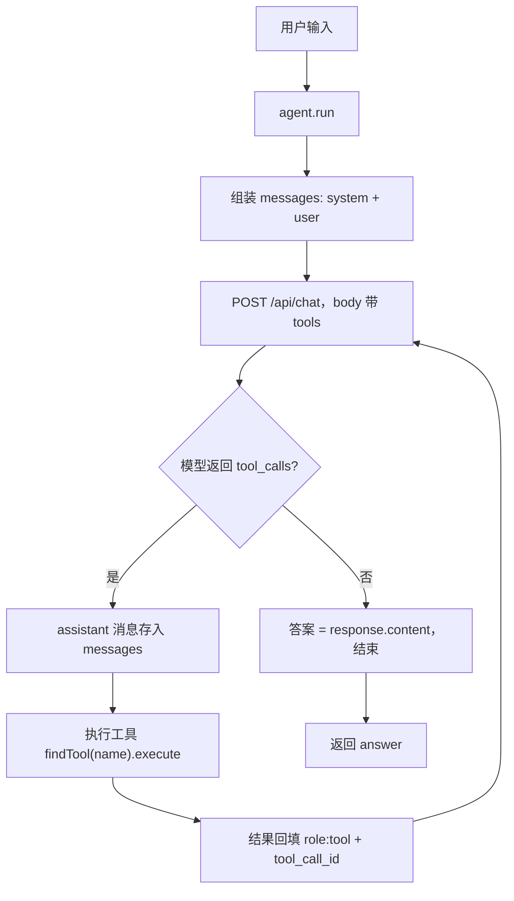
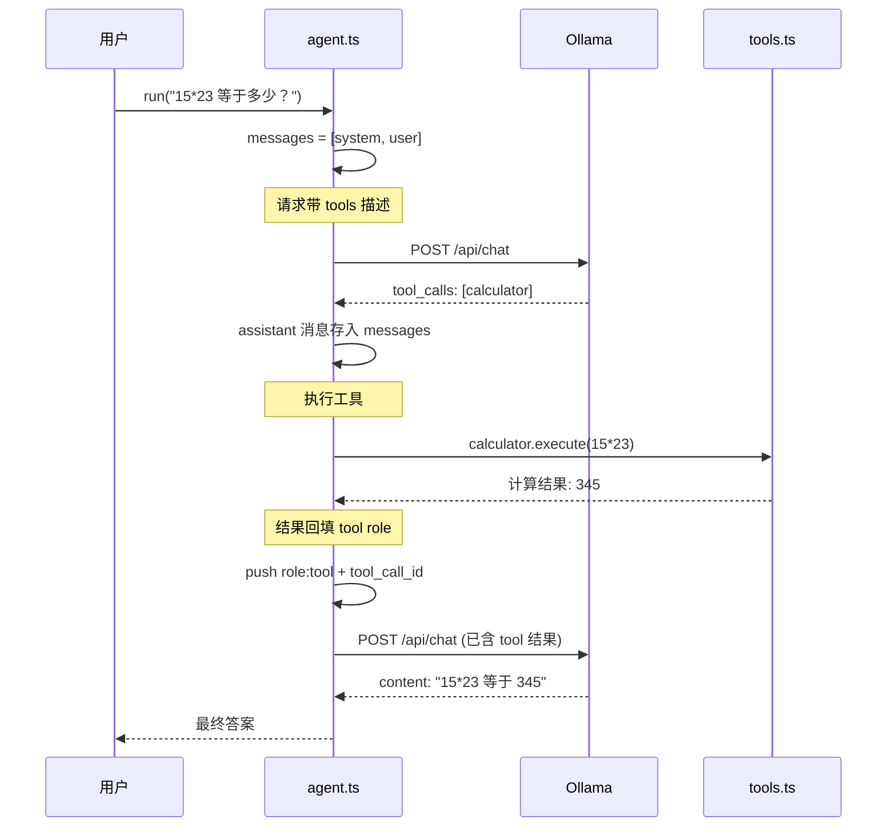

# function-calling —— 纯手写 Function Calling（不依赖 LangChain）

一个**零依赖**（连 mathjs 都不用，只有 typescript + tsx）的 Agent，直接调 Ollama 的 `/api/chat` 接口，完整手写 Function Calling 协议。用来理解：**LangChain 的 `bindTools` / `tool()` 到底替你做了什么**。

## 快速开始

```bash
# 前提：Ollama 运行中，且有本地模型（.env 的 MODEL_NAME）
npm install
npm run interactive            # 交互模式
# 或
npx tsx src/main.ts single "15*23 等于多少？"
```

试试：
- `15*23 等于多少？` → 触发 calculator
- `现在几点了？` → 触发 get_current_time
- `你好` → 无需工具，直接回答

## 目录结构

```
function-calling/
└── src/
    ├── main.ts    # CLI（交互 / single）
    ├── agent.ts   # 纯 fetch 手写 Function Calling 协议
    └── tools.ts   # 普通 TS 对象定义工具 + 执行器
```

## 手写实现 vs LangChain 对照

| 环节 | 本仓库手写版 | LangChain 版（context 实验） |
| --- | --- | --- |
| 定义工具 | 普通 TS 对象 `{ type, function: { name, description, parameters } }` | `tool(fn, { name, description, schema })` |
| 把工具给模型 | fetch body 里 `tools: [...]` 手动拼 | `llm.bindTools(allTools)` 内部 `convertToOpenAITool` |
| 模型返回调用 | 读 `response.message.tool_calls` | `response.tool_calls` |
| 执行工具 | `findTool(name).execute(args)` 手动分发 | `tool.invoke(toolCall.args)` |
| 回填结果 | 手动 push `{ role: 'tool', tool_call_id, content }` | `new ToolMessage({ content, tool_call_id })` |
| zod schema | 手写 `properties` / `required` | `zod` + `toJsonSchema` 自动转 |

**结论：LangChain 只是把"工具描述→请求→响应→回填"这套协议封装好了。模型并不认识你的 TS 类，它只认识 `tools` 数组里的 JSON 描述。**

## 核心实现（agent.ts）

### 0. 总览：一次调用的完整流程

以下流程图展示 `agent.run("15*23 等于多少？")` 时，代码、Ollama、工具三者如何协作：



**对应到 `agent.ts` 的 `run()` 主循环：** `B → C` 是 `chat()`；`D` 是 `if (!response.tool_calls ...)` 分支；`F → G → H` 是 `for (const call of response.tool_calls)` 循环。

### 0.1 时序图：带完整消息历史的视角

下图展示**每一轮发给 Ollama 的 `messages` 数组如何增长**——这是理解 Function Calling 的关键：历史里同时存了"带 tool_calls 的 assistant 消息"和"对应的 tool 结果"，模型才能多轮推理不混乱。



> 注意第 2 次请求的 `messages` 里多了两条：`assistant(tool_calls)` 和 `tool(结果)`。**`tool_call_id` 必须与模型返回的 `id` 一致**，否则模型无法把结果对应到上一次的调用。

### 1. 请求：把工具描述给模型

```ts
const body = {
  model: this.model,
  messages,
  tools: tools.map((t) => t.definition), // ← 模型"知道"有这些工具
  temperature: 0,
  stream: false, // 一次性返回完整 JSON（不是 NDJSON 流）
};
const resp = await fetch(`${baseUrl}/api/chat`, { method: 'POST', body: JSON.stringify(body) });
```

### 2. 响应：模型说"我要用工具"

模型返回的 `message.tool_calls` 形如：

```json
{
  "tool_calls": [{
    "id": "call_xxx",
    "function": { "name": "calculator", "arguments": { "expression": "15*23" } }
  }]
}
```

> 注意：Ollama 返回的 `arguments` 可能是**对象**也可能是 **JSON 字符串**（不同模型/版本行为不同），代码里做了兼容处理。

### 3. 回填：工具结果以 `role: "tool"` 返回

```ts
messages.push({
  role: 'tool',
  content: result,        // 工具执行结果
  tool_call_id: call.id,  // 必须和模型返回的 id 一致
});
```

然后把**带 `tool_calls` 的 assistant 消息**也存进历史（`messages.push(response)`），继续下一轮循环。模型看到工具结果后，要么继续调工具，要么给出最终答案。

### 主循环（思考-行动-观察）

对应第 0 节的流程图，代码骨架如下：

```
循环直到 maxIterations:
  1. chat() 发请求（带 tools）           → 模型"思考"
  2. 模型没返回 tool_calls → 最终答案     → 结束
  3. 模型返回 tool_calls → 执行工具
     → 结果回填 tool role → 继续循环      → "行动 + 观察"
```

## 踩过的坑（值得记录）

1. **Ollama 默认流式返回 NDJSON**：需要 `stream: false` 才能用 `resp.json()` 一次性解析；否则要逐行读 NDJSON。
2. **`arguments` 格式不固定**：Ollama 返回对象，OpenAI 返回字符串。解析要兼容两者。
3. **回填必须带 `tool_call_id`**：不带或 id 对不上，模型多轮会错乱。
4. **安全计算**：`safeCalc` 限制了字符白名单（仅数字 + 四则运算符）；`Function` 构造器仅用于教学演示，生产请用 mathjs 或自定义解析器。

## 动手挑战

- 加一个工具：比如"查当前天气"（返回假数据即可），看模型会不会自动选择它。
- 去掉 `tools` 字段再跑一次，观察模型行为（对照 context 实验的 `no_tool_calls` 模式）。
- 打印第 3 步的完整 `messages` 数组，理解 `tool` 角色消息在历史里的位置。

## 参考

- Ollama API 文档：https://github.com/ollama/ollama/blob/main/docs/api.md
- OpenAI Function Calling 协议：https://platform.openai.com/docs/guides/function-calling