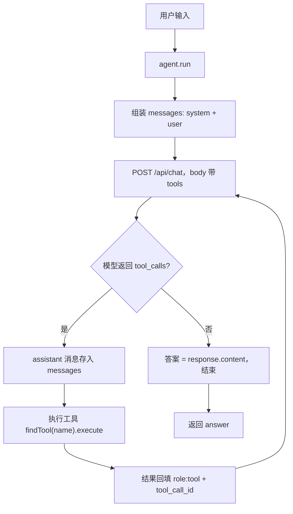
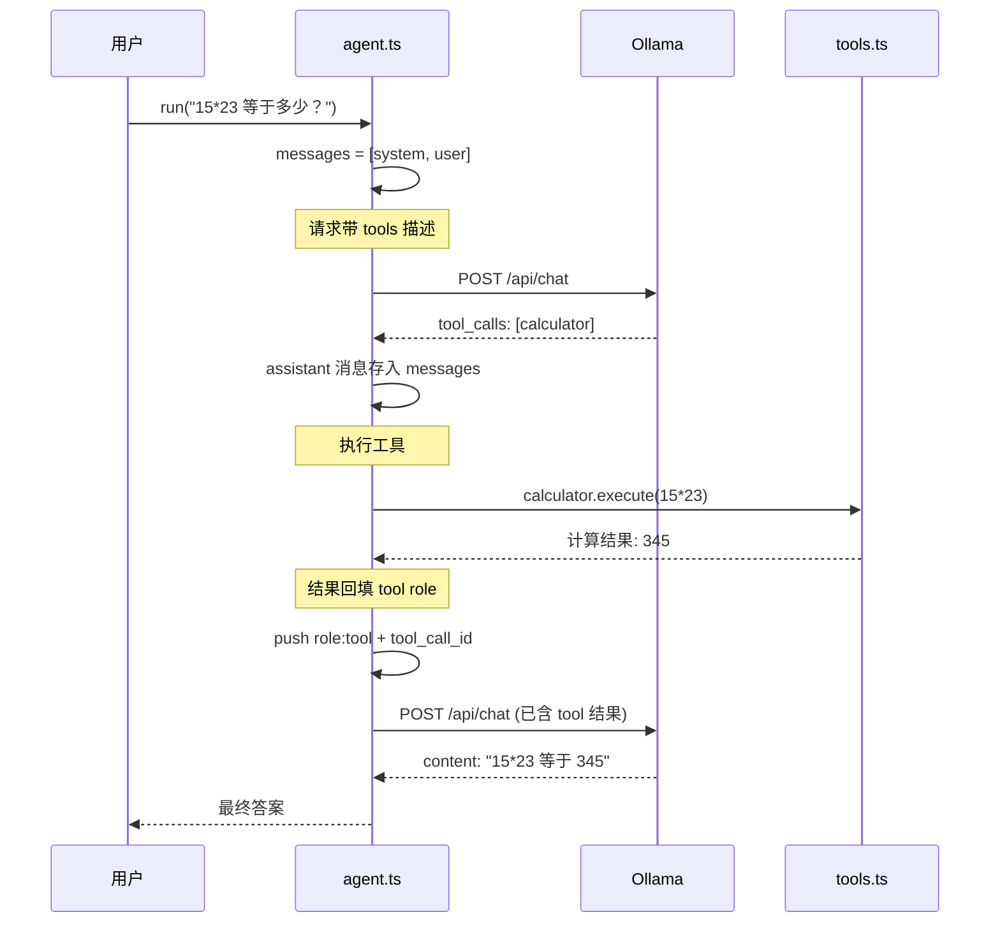
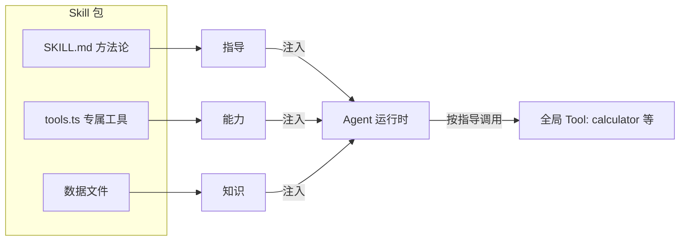
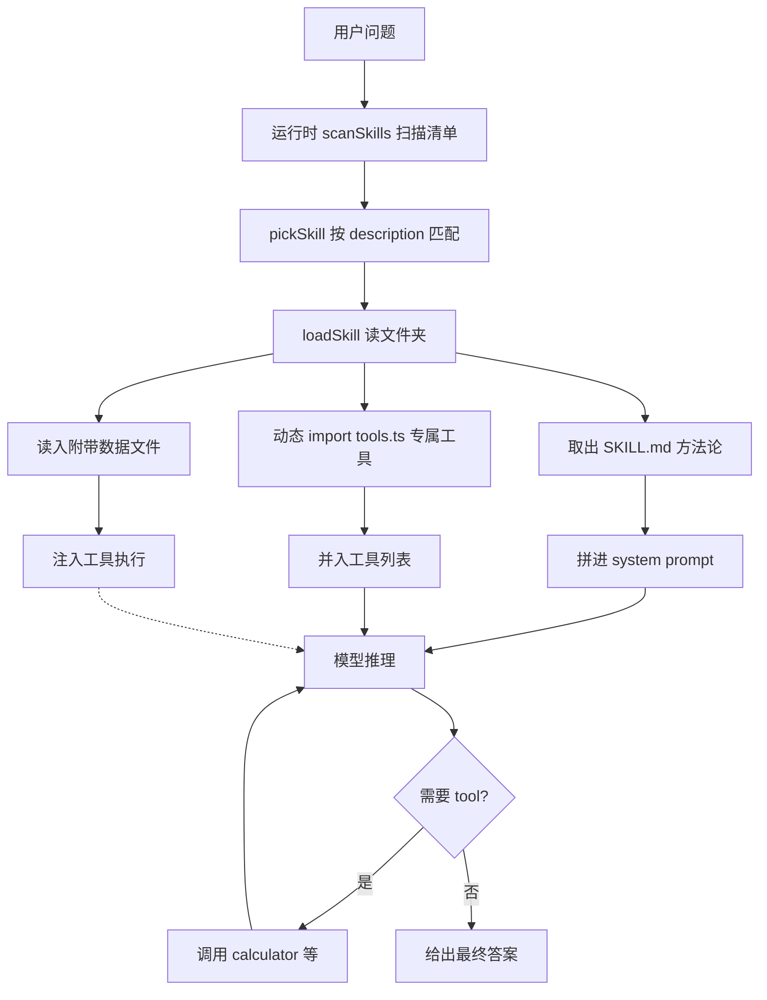

# function-calling —— 纯手写 Function Calling（不依赖 LangChain）

一个**零依赖**（连 mathjs 都不用，只有 typescript + tsx）的 Agent，直接调 Ollama 的 `/api/chat` 接口，完整手写 Function Calling 协议。用来理解：**LangChain 的 `bindTools` / `tool()` 到底替你做了什么**。

本实验分两大主题，建议按顺序学：
1. **手写 Function Calling 协议**（第 1-3 节）——模型如何"调用工具"
2. **Skill 技能包**（第 4 节）——方法论如何"指导调用"，及其进阶能力（对齐 Agent Skills 规范）

## 快速开始

```bash
# 前提：Ollama 运行中，且有本地模型（.env 的 MODEL_NAME）
npm install
npm run interactive            # 交互模式
# 或
npx tsx src/main.ts single "15*23 等于多少？"
```

试试：
- `15*23 等于多少？` → 触发 calculator
- `现在几点了？` → 触发 get_current_time
- `你好` → 无需工具，直接回答
- `/skill weather-report` 后问"北京天气" → 加载 skill 的专属工具

## 目录结构

```
function-calling/
├── src/
│   ├── main.ts    # CLI（interactive / single / skill / advanced-demo）
│   ├── agent.ts   # 纯 fetch 手写 Function Calling 协议 + 运行时授权
│   ├── tools.ts   # 普通 TS 对象定义工具 + 执行器
│   └── skills.ts  # skill 加载器（对齐 Agent Skills 规范）
└── skills/        # 每个 skill 一个文件夹
    ├── calculator-expert/
    │   └── SKILL.md
    ├── time-aware/
    │   └── SKILL.md
    └── weather-report/
        ├── SKILL.md
        ├── tools.ts         # skill 专属工具
        └── city-codes.json  # skill 附带数据文件
```

## 手写实现 vs LangChain 对照

| 环节 | 本仓库手写版 | LangChain 版（context 实验） |
| --- | --- | --- |
| 定义工具 | 普通 TS 对象 `{ type, function: { name, description, parameters } }` | `tool(fn, { name, description, schema })` |
| 把工具给模型 | fetch body 里 `tools: [...]` 手动拼 | `llm.bindTools(allTools)` 内部 `convertToOpenAITool` |
| 模型返回调用 | 读 `response.message.tool_calls` | `response.tool_calls` |
| 执行工具 | `findTool(name).execute(args)` 手动分发 | `tool.invoke(toolCall.args)` |
| 回填结果 | 手动 push `{ role: 'tool', tool_call_id, content }` | `new ToolMessage({ content, tool_call_id })` |
| zod schema | 手写 `properties` / `required` | `zod` + `toJsonSchema` 自动转 |

**结论：LangChain 只是把"工具描述→请求→响应→回填"这套协议封装好了。模型并不认识你的 TS 类，它只认识 `tools` 数组里的 JSON 描述。**

## 核心实现（agent.ts）

### 0. 总览：一次调用的完整流程

以下流程图展示 `agent.run("15*23 等于多少？")` 时，代码、Ollama、工具三者如何协作：



**对应到 `agent.ts` 的 `run()` 主循环：** `B → C` 是 `chat()`；`D` 是 `if (!response.tool_calls ...)` 分支；`F → G → H` 是 `for (const call of response.tool_calls)` 循环。

### 0.1 时序图：带完整消息历史的视角

下图展示**每一轮发给 Ollama 的 `messages` 数组如何增长**——这是理解 Function Calling 的关键：历史里同时存了"带 tool_calls 的 assistant 消息"和"对应的 tool 结果"，模型才能多轮推理不混乱。



> 注意第 2 次请求的 `messages` 里多了两条：`assistant(tool_calls)` 和 `tool(结果)`。**`tool_call_id` 必须与模型返回的 `id` 一致**，否则模型无法把结果对应到上一次的调用。

### 1. 请求：把工具描述给模型

```ts
const body = {
  model: this.model,
  messages,
  tools: tools.map((t) => t.definition), // ← 模型"知道"有这些工具
  temperature: 0,
  stream: false, // 一次性返回完整 JSON（不是 NDJSON 流）
};
const resp = await fetch(`${baseUrl}/api/chat`, { method: 'POST', body: JSON.stringify(body) });
```

### 2. 响应：模型说"我要用工具"

模型返回的 `message.tool_calls` 形如：

```json
{
  "tool_calls": [{
    "id": "call_xxx",
    "function": { "name": "calculator", "arguments": { "expression": "15*23" } }
  }]
}
```

> 注意：Ollama 返回的 `arguments` 可能是**对象**也可能是 **JSON 字符串**（不同模型/版本行为不同），代码里做了兼容处理。

### 3. 回填：工具结果以 `role: "tool"` 返回

```ts
messages.push({
  role: 'tool',
  content: result,        // 工具执行结果
  tool_call_id: call.id,  // 必须和模型返回的 id 一致
});
```

然后把**带 `tool_calls` 的 assistant 消息**也存进历史（`messages.push(response)`），继续下一轮循环。模型看到工具结果后，要么继续调工具，要么给出最终答案。

### 主循环（思考-行动-观察）

对应第 0 节的流程图，代码骨架如下：

```
循环直到 maxIterations:
  1. chat() 发请求（带 tools）           → 模型"思考"
  2. 模型没返回 tool_calls → 最终答案     → 结束
  3. 模型返回 tool_calls → 执行工具
     → 结果回填 tool role → 继续循环      → "行动 + 观察"
```

## 踩过的坑（值得记录）

1. **Ollama 默认流式返回 NDJSON**：需要 `stream: false` 才能用 `resp.json()` 一次性解析；否则要逐行读 NDJSON。
2. **`arguments` 格式不固定**：Ollama 返回对象，OpenAI 返回字符串。解析要兼容两者。
3. **回填必须带 `tool_call_id`**：不带或 id 对不上，模型多轮会错乱。
4. **安全计算**：`safeCalc` 限制了字符白名单（仅数字 + 四则运算符）；`Function` 构造器仅用于教学演示，生产请用 mathjs 或自定义解析器。

## Skill：方法论注入

先看整体关系：**Tool 提供"能做什么"，Skill 指导"该怎么做"**。skill 是"方法论 + 可选专属工具/数据"的打包，模型按 skill 的指导去调用 tool。



**skill 从"文件夹"到"模型可用"的加载流程：**



`skills/` 目录演示了 **Skill（技能包）** 概念——它和 tool 是不同层面的东西：

| | Tool（前面学的） | Skill（本节） |
| --- | --- | --- |
| 是什么 | 可调用的函数 | 一段预写好的方法论指导（Markdown） |
| 模型怎么用 | 返回 `tool_calls` 去调用 | 读进上下文，按它说的流程做 |
| 你的代码要做的 | 定义 `execute` + 解析参数 | 把 skill 文本拼进 system prompt |
| 类比 | 给模型一把计算器 | 给模型一本操作规程手册 |

### Skill 的标准形态：一个文件夹

真实框架（如 Claude Agent Skills）里，每个 skill 是一个**独立文件夹**：

```
skills/
├── calculator-expert/
│   └── SKILL.md              # 方法论指导（必选）
├── time-aware/
│   └── SKILL.md
└── weather-report/
    ├── SKILL.md              # 方法论指导
    ├── tools.ts              # 该 skill 专属的工具（可选）
    └── city-codes.json       # 附带数据文件（可选）
```

- `SKILL.md`：一段 Markdown 指导，加载时拼进 system prompt
- `tools.ts`：该 skill **专属的工具定义**，加载该 skill 时才注册给模型

**这是"skill 附带 tools"的关键：模型的能力是可插拔的。** 不加载 `weather-report`，模型根本不知道有 `get_weather` 这个工具；加载后，工具才出现在它的工具列表里。

### 运行方式

```bash
npm run skill calculator-expert "先算 15*23，再算 8+9，然后加起来？"
npm run skill weather-report "北京天气怎么样？"     # 加载 skill 的专属工具 get_weather
npm run skill-demo          # 同一问题对比 无skill / calculator-expert / time-aware
npm run interactive         # 交互模式里用 /skill <name> 动态切换
```

### 代码怎么实现的（src/skills.ts）

```ts
// 1. 扫描 skills/ 目录，每个文件夹 = 一个 skill
listSkills();  // ['calculator-expert', 'time-aware', 'weather-report']

// 2. 加载 skill：读 SKILL.md + 动态 import 同目录的 tools.ts
const skill = await loadSkill('weather-report');
// skill.instruction → SKILL.md 内容
// skill.tools      → weather-report/tools.ts 导出的工具数组
```

```ts
// 3. agent 构造时：方法论拼进 system，专属工具并入工具列表
class FunctionCallingAgent {
  static async create({ skillName }) {
    const skill = await loadSkill(skillName);       // 含专属工具
    return new FunctionCallingAgent({
      skill,                                        // 注入
    });
  }
  // constructor 里：
  //   this.allTools = [...全局工具, ...skill.tools]  // 能力随 skill 扩展
}
```

### 实测效果

**场景 1：方法论影响行为**（同问题 `先算 15*23，再算 8+9，然后加起来？`）

| 配置 | 行为 | 工具调用 |
| --- | --- | --- |
| 无 skill | 一次塞进一个表达式 `(15*23)+(8+9)` | 1 次 |
| calculator-expert | 分 3 步独立调用：`15*23` → `8+9` → `345+17` | 3 次 |

**场景 2：skill 附带专属工具**（同问题 `北京天气怎么样？`）

| 配置 | get_weather 可用? | 行为 |
| --- | --- | --- |
| 无 skill | ❌ 模型不知道此工具 | 凭记忆作答，0 次调用 |
| weather-report | ✅ 加载时注册 | 调用 get_weather → 数据 → 作答 |

**结论：skill 不增加模型固有知识，而是"方法论 + 可选能力"的可插拔包。** 加载它，模型既多了一份操作规范，也多了专属工具。

### 进阶：真实框架 skill 的三大能力

上面是"最简单形态"。真实框架（**Agent Skills 规范**，见 <https://agentskills.io/specification>）在此基础上还有三个工程能力，本项目也用 `advanced-demo` 实现：

```bash
npm run advanced-demo
```

> 以下 frontmatter 字段对齐官方规范：`name` / `description` 必选，`allowed-tools`（空格分隔的工具名列表）可选。

#### 1. 按需动态加载（自动匹配，无需人指定）

给每个 skill 加 `frontmatter` 元数据（name / description），运行时扫描"技能清单"，按问题自动匹配：

```md
---
name: weather-report
description: 查询城市天气。当用户询问天气、温度、晴雨时使用。
allowed-tools: get_weather
---
```

```ts
const skills = scanSkills();       // 扫描所有 skill 的元数据
const matched = pickSkill(question); // 按关键词匹配最合适的
// "北京天气" → weather-report
```

#### 2. 附带可执行脚本 / 数据文件

skill 文件夹里除了 SKILL.md，还能带任意资源。加载时把数据解析后**注入工具**：

```
skills/weather-report/
├── SKILL.md
├── tools.ts              # 可执行工具
└── city-codes.json       # 附带数据文件
```

```ts
// loadSkill 把 city-codes.json 读进 skill.files，
// 再用 createWeatherTool(cityCodes) 工厂把数据注入工具
const cityCodes = JSON.parse(skill.files['city-codes.json']);
tools = createWeatherTool(cityCodes);  // 工具执行时能访问附带数据
```

#### 3. 运行时授权（allowed-tools）

skill 的 frontmatter 声明 `allowed-tools`（该 skill 允许使用哪些工具），Agent 运行时执行前检查。**授权判断在运行时层，不在 skill 文件里**：

```md
# SKILL.md frontmatter 声明
allowed-tools: get_weather
```

```ts
// agent.ts（运行时层）执行前拦截
// canExecute(): 无 skill 放行所有工具；有 skill 只放行 allowed-tools 声明的
if (this.allowedTools.size > 0 && !this.allowedTools.has(name)) {
  return `⛔ skill 的 allowed-tools 未包含 ${name}`;
}
```

**advanced-demo 实测输出（节选）：**

```
【1】按需动态加载
  问题 "北京天气怎么样？" → 自动匹配到 skill: weather-report
【2】附带数据文件
  allowed-tools 声明: get_weather
  附带数据文件: city-codes.json
  专属工具: get_weather
【3】运行时授权
  声明允许 (weather-report): canExecute(get_weather) = true
  未声明 (allowed-tools: calculator): canExecute(get_weather) = false
      ← skill 的 allowed-tools 未包含 get_weather（声明为: calculator）
```

> 真实框架还有更细粒度的权限（如"只允许写 /tmp"、按域名限制网络访问等），核心思想一致：**skill 声明允许的工具（allowed-tools），运行时按需授权执行。**

## 概念澄清

### scanSkills / pickSkill / loadSkill 是什么

这三个是 `src/skills.ts` 里的三个函数，对应 skill 生命周期的**三个阶段**。不是官方名词，而是对真实框架"技能管理"流程的拆分：

| 函数 | 阶段 | 干什么 | 真实框架对应 |
| --- | --- | --- | --- |
| `scanSkills()` | 扫描 | 遍历 `skills/`，读每个 `SKILL.md` 的 frontmatter，得到技能清单 | Agent 启动时盘点有哪些技能可用 |
| `pickSkill(问题)` | 匹配 | 按用户问题挑最合适的 skill（返回名字） | Agent 判断"这个问题该用哪个技能" |
| `loadSkill(名字)` | 加载 | 读 SKILL.md 正文 + 动态 import tools.ts + 读数据文件，组装成 skill 包 | Agent 把选中技能的内容注入上下文 |

**打个比方：** `scanSkills()` = 翻技能书目录；`pickSkill()` = 查目录判断看哪一章；`loadSkill()` = 翻到那一章读进脑子。

### 加载 skill 的"那个东西"是谁

官方规范文档（agentskills.io）和 Anthropic 官方博客的原文是：

> "At startup, the **agent** pre-loads the name and description of every installed skill... Claude **will load the skill** by reading its full SKILL.md into context."

也就是说，**扫描、匹配、加载、授权这些动作，官方就叫它们由 Agent 自己（或 Agent 所在的运行时/框架）完成**。你在网上看到的 "host"（宿主）是对"运行 Agent 的环境/框架"的非正式叫法（比如 Claude Code、opencode 这类本地运行时习惯这么叫），但它**不是官方规范术语**。

本项目里 `FunctionCallingAgent` 类同时承担了两类职责：
- **Agent 本体**：`run()` 的 while 循环——调 LLM、决定要不要调工具、执行 tool_calls（真正"思考干活"的部分）
- **运行时/框架**：`scanSkills` / `pickSkill` / `loadSkill`、`canExecute()` 授权检查、把 skill 注入上下文（"管理技能和权限"的部分）

为了教学简单把两者合并在一个类里。理解时记住这个区分即可：**思考干活的是 Agent，管理技能和权限的是运行时（网上也叫 host/宿主）。**

## 参考

- Ollama API 文档：https://github.com/ollama/ollama/blob/main/docs/api.md
- OpenAI Function Calling 协议：https://platform.openai.com/docs/guides/function-calling
- Agent Skills 规范：https://agentskills.io/specification
- Anthropic 官方博客：https://anthropic.com/engineering/equipping-agents-for-the-real-world-with-agent-skills