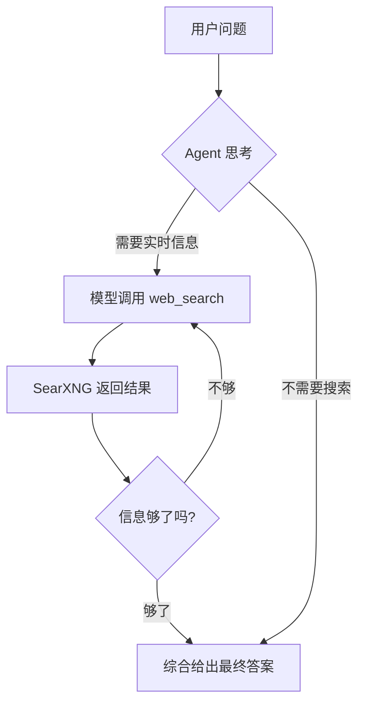

# web-search-agent —— 联网搜索 Agent（TypeScript 练习）

一个自带联网搜索能力的 Agent：本地 LLM（Ollama）在思考过程中**自主决定何时调用 `web_search` 工具**，通过自部署的 **SearXNG** 搜索实时信息、迭代多轮，最后综合给出答案。

全程本地运行，无需任何云端 API Key。



## 快速开始

```bash
# 0. 前提：Docker（跑 SearXNG）+ Ollama（跑本地模型，如 gemma4:latest）
#    确认 .env 里的 MODEL_NAME 是你本地已有的模型

# 1. 一键启动 SearXNG（首次自动拉镜像，等待就绪）
./scripts/searxng.sh start

# 2. 安装依赖
npm install

# 3. 运行（安装依赖后，`npm run <模式>` 与 `npx tsx src/main.ts <模式>` 等价）
npm run interactive                                   # 交互模式
# 等价: npx tsx src/main.ts interactive
npm run single -- "2026年AI领域最新进展是什么？"       # 单次问题
# 等价: npx tsx src/main.ts single "2026年AI领域最新进展是什么？"
npx tsx src/main.ts example 1                         # 内置示例
```

## 目录结构

```
web-search-agent/
├── src/
│   ├── main.ts        # CLI：interactive / single / example
│   ├── agent.ts       # WebSearchAgent：ReAct 循环 + 轨迹记录
│   ├── tools.ts       # web_search 工具（LangChain tool 封装）
│   ├── search.ts      # SearXNG 客户端
│   └── examples.ts    # 内置示例问题
├── scripts/searxng.sh # SearXNG 一键启动/停止/重启/状态/日志
├── docker-compose.yml # SearXNG 容器编排
├── searxng/settings.yml # SearXNG 配置（已开启 JSON API）
├── .env.example       # 环境变量模板
└── package.json
```

## 核心实现讲解

### 1. Agent 的 ReAct 循环（`src/agent.ts`）

核心是 `WebSearchAgent.searchAndAnswer()` 的 while 循环，与实验 1-1 的循环结构一致，但目的不同：

```
循环直到 maxIterations（默认 5）:
  1. 把「系统提示词 + 对话历史」发给本地 LLM（已绑定 web_search 工具）
  2. 若模型返回 tool_calls → 执行搜索 → 结果回填为 tool role 消息 → 继续循环
  3. 若模型不再调用工具 → 视为最终答案，返回
```

几个实现细节：

- **消息回填**：工具结果用 `ToolMessage({ content, tool_call_id })` 回填，`tool_call_id` 必须与模型返回的 `id` 一致，否则多轮对话会报错。
- **轨迹记录**：每次循环把「思考/行动/观察/答案」记入 `trace`，`verbose` 模式下实时打印（💭🔧👀✅），让 ReAct 过程肉眼可见。
- **终止条件**：由模型自己决定何时"信息够了"。若搜索了 `maxIterations` 轮仍未收尾，则返回兜底文案——这是防止死循环的关键闸门。

### 2. 搜索工具封装（`src/tools.ts` + `src/search.ts`）

两层结构，职责分离：

- `search.ts` —— **纯搜索客户端**：封装 SearXNG 的 `GET /search?q=<query>&format=json`，返回结构化 `SearchResult[]`。不含任何 LLM 概念，可独立测试。
- `tools.ts` —— **工具适配层**：用 LangChain 的 `tool()` 把搜索客户端包成模型可调用的 `web_search`，用 zod 定义入参 `{ query, max_results? }`。

```ts
tool(
  async ({ query, max_results }) => {
    const results = await engine.search({ q: query, maxResults: max_results });
    return formatResults(results);   // 压缩成紧凑文本喂给模型
  },
  { name: 'web_search', schema: z.object({ query: z.string(), max_results: z.number().optional() }) }
)
```

**`formatResults` 的作用**：把搜索结果压缩成"编号 + 标题 + 来源 + 摘要（截断 200 字）"的紧凑文本。这一步很重要——不截断的话搜索结果会撑爆上下文。

### 3. 一键启动 SearXNG（`scripts/searxng.sh`）

| 命令 | 作用 |
| --- | --- |
| `start` | 启动（自动拉镜像、等待就绪） |
| `stop` | 停止并移除容器 |
| `restart` | 重启并等待就绪 |
| `status` | 查看容器状态 |
| `logs` | 跟踪容器日志 |

- 容器编排在 `docker-compose.yml`，配置在 `searxng/settings.yml`。
- **关键配置**：`search.formats` 里加了 `json`，否则 SearXNG 只返回 HTML，程序无法解析。
- `start` 内置健康检查：循环请求 `search?format=json`，就绪才提示成功。

## 交互模式命令

```
examples        - 查看内置示例问题
example <n>     - 运行第 n 个示例
verbose off/on  - 关闭/打开 ReAct 轨迹输出
quit / exit     - 退出
或直接输入任意问题
```

## 学习路径

按这个顺序读代码：

1. **先跑起来**：`./scripts/searxng.sh start` + `npm run interactive`，输入一个实时性问题（如"今天美元兑人民币汇率"），观察轨迹里的"行动→观察"循环。
2. **读 `search.ts`**：最独立的一层——看怎么调 SearXNG JSON API、怎么把响应映射成 `SearchResult`。
3. **读 `tools.ts`**：看 `tool()` + zod 怎么定义一个模型可调用的工具。
4. **读 `agent.ts`**：重点看 `searchAndAnswer()` 的 while 循环——工具调用怎么执行、结果怎么回填、循环怎么终止。
5. **对照实验 1-1（context）**：两者的 ReAct 循环结构几乎一样，差别在于——1-1 的工具是"计算/汇率/PDF"（确定性工具），这里是"搜索"（外部数据源）。想通这个对比，你就理解了 Agent 工具的本质。

## 动手挑战

- **换模型**：改 `.env` 的 `MODEL_NAME`（需本地已 pull），观察不同模型"何时觉得信息够了"的差异。
- **换搜索后端**：`search.ts` 是唯一需要改的地方——想接 Tavily 或官方 Kimi，实现同样的 `SearchEngine` 接口即可。
- **改多轮策略**：调整 `maxIterations`、让 `formatResults` 返回更多/更少内容，观察对答案质量的影响。
- **观察模型缺陷**：本地 7B 模型偶尔会"搜了一次就下结论"或"反复搜索不收敛"——这些正是要理解的真实问题。

## 参考

- 官方课程与实现：https://github.com/bojieli/ai-agent-book/tree/main/chapter1/web-search-agent
- SearXNG 文档：https://docs.searxng.org/
- LangChain.js：https://js.langchain.com/