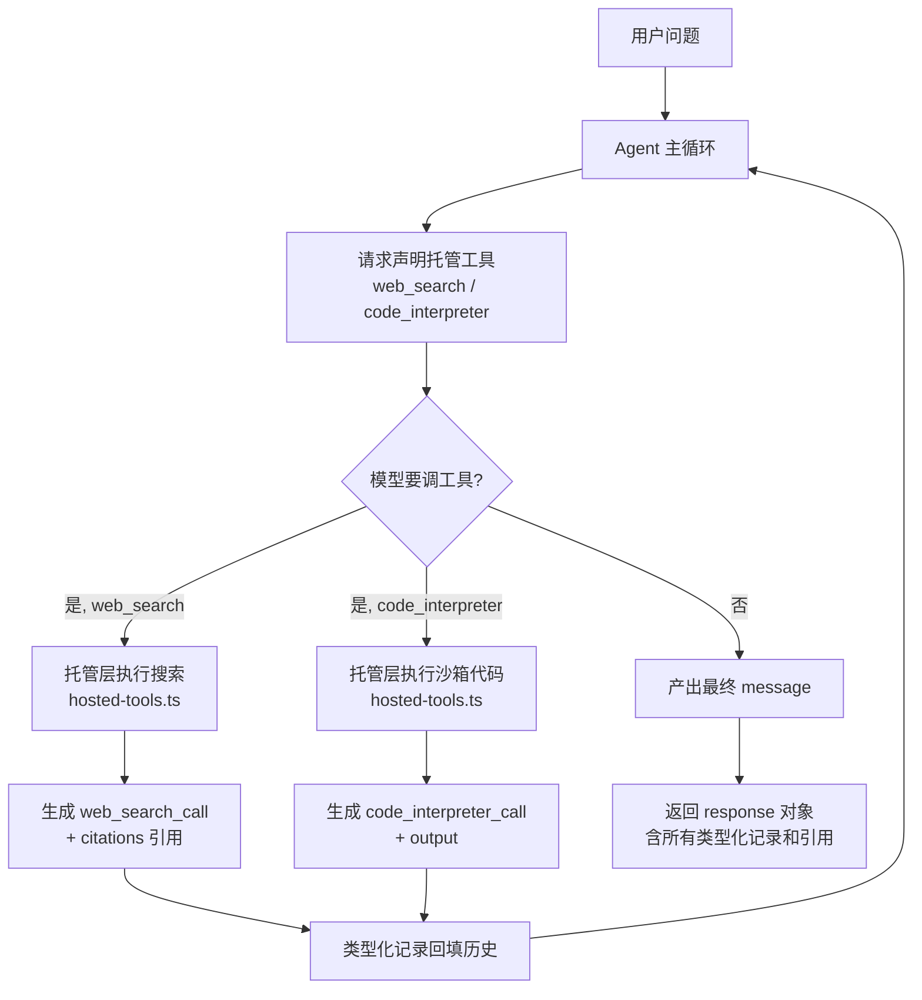

# search-codegen —— 托管工具 Agent（web_search + code_interpreter）

对应官方实验 1-3：托管 `web_search` + 托管 `code_interpreter` 的深度研究 Agent。

本仓库为 **TypeScript 本地仿真版**（Ollama + SearXNG），目标是**理解 Responses API 的"托管工具"协议**，无需任何云端 API Key。

## 与之前实验的核心区别（先看这个）

| | 0.function-calling | 本实验（Responses 风格） |
| --- | --- | --- |
| 工具来源 | 自己写（calculator 等） | **托管工具**（web_search / code_interpreter） |
| 模型返回 | `tool_calls`「请求」调用 → **你的代码执行** | **已完成**的类型化记录：`web_search_call` / `code_interpreter_call` |
| 执行位置 | 你的代码（本地可见） | **托管层/服务端**（Agent 只看到结果） |
| 结果形式 | 工具返回文本 | 类型化记录 + **URL 引用**（citations） |

**一句话：** function-calling 是"模型请求、你执行"；Responses 托管工具是"模型声明、服务端执行、返回带引用的结果记录"。

## 本章在学什么（概念展开）

这一章只引入一个**新概念：托管工具（hosted tools）**——工具不再是你写的，而是平台（服务端）替你执行。其余全是前几章知识的复用。

### 方式 A vs 方式 B：两种"调工具"

想象两种请助手的方式：

**方式 A（前几章）：你给助手工具说明书，它喊你干活**
```mermaid
flowchart LR
    subgraph 你(代码)
        CALC[calculator 工具<br/>说明书 + 执行逻辑]
    end
    subgraph 助手(模型)
        M1[需要算 15×23] --> M2[喊: 调用 calculator<br/>参数 15*23]
        M3[拿到 345] --> M4[继续推理]
    end
    M2 -->|tool_calls 请求| CALC
    CALC -->|返回 345| M3
```

**方式 B（本章）：你只告诉助手"有这俩工具"，平台替它干活**
```mermaid
flowchart LR
    subgraph 平台(托管层)
        WS[web_search 执行]
        CI[code_interpreter 执行]
    end
    subgraph 助手(模型)
        N1[需要搜信息] --> N2[心想: 用 web_search]
        N3[拿到 web_search_call<br/>+ 引用链接] --> N4[需要算]
        N4 --> N5[心想: 用 code_interpreter]
        N6[拿到 code_interpreter_call<br/>+ 结果]
    end
    N2 --> WS
    WS -->|web_search_call 已完成记录| N3
    N5 --> CI
    CI -->|code_interpreter_call 已完成记录| N6
```

**关键差异：**
- 方式 A：模型返回 `tool_calls`（**"我要调"**），你拿到后**自己执行**
- 方式 B：模型返回**已经完成的结果记录**（**"我已经调了"**），执行过程 Agent 代码**看不到**

### 为什么叫"类型化记录"（typed items）

Responses 的响应不是一段字符串，而是一个 **items 列表**，每项有明确类型：

```json
{
  "output": [
    { "type": "web_search_call", "status": "completed", "citations": ["url1", "url2"] },
    { "type": "code_interpreter_call", "status": "completed", "output": "309.2" },
    { "type": "message", "content": [{ "type": "output_text", "text": "最近的是吉隆坡-新加坡" }] }
  ]
}
```

**为什么类型化重要？** 程序能**精确判断**"模型到底用没用工具、用了哪个、结果是什么"——而不是读模型文字去猜。官方验收逻辑正是基于此：

> "答案说它用了 Python" 不算数，必须有 `code_interpreter_call` 记录才算真用了。

### 协议层 vs 模型层

跑通一个"深度研究"任务，需要两层配合：

| | 协议层（protocol） | 模型层（model） |
| --- | --- | --- |
| 是什么 | 工具如何描述/调用/记录结果的**约定** | **LLM 的推理与决策能力** |
| 决定什么 | 工具**能不能用** | 模型**会不会用好工具** |
| 谁保证 | 代码/平台（稳定可靠） | 模型本身（依赖能力） |
| 例 | `web_search_call` 长什么样、引用怎么带 | 何时调工具、调哪个、调几次、何时收尾 |
| 验证 | `protocol-demo` 每次都能成功 | `scenario-asean` 本地模型会卡住 |

**一句话：协议层决定"工具能不能用"，模型层决定"模型会不会用好工具"。** 本地 gemma 的失败是模型层问题，不是协议层问题。

### "Model as Agent"（模型当操盘手）

一个深度研究任务的正确流程是**闭环**：`搜索 → 拿到数据(引用) → 写代码计算 → 产出带引用答案`。模型需要自己**编排**这条链路——什么时候搜、搜完怎么处理、什么时候转去算。这就是 "Model as Agent"。

> 注意：scenario-asean 里模型**一直在调用工具**（只调 web_search），不是"不调工具"——而是**不会编排多工具的先后顺序**：搜了 8 次，从没推进到"用代码算距离"。工具越强，模型越需要好的编排能力。

## 快速开始

```bash
# 前提：Ollama 运行 + SearXNG 运行（托管 web_search 的后端）
#   cd 2.web-search-agent && ./scripts/searxng.sh start

npm install

# ① 带注释的逐行演示（推荐第一个看）：像讲课一样一步步理解协议
npm run walkthrough

# ② 协议演示：手动驱动托管工具闭环，稳定可复现
npm run protocol-demo

# ③ 东盟首都最近距离（模型驱动：搜索 + 计算，体会模型编排）
npm run scenario-asean

# ④ 比特币技术分析（澄清优先：先问再搜）
npm run scenario-bitcoin

# ⑤ 交互模式
npm run interactive
```

## 目录结构

```
3.search-codegen/
├── src/
│   ├── main.ts           # CLI + 场景 + 协议演示
│   ├── agent.ts          # 手写 Responses 风格 Agent（托管工具编排）
│   ├── protocol.ts       # Responses 协议类型：类型化 tool 记录 + 引用
│   ├── hosted-tools.ts   # 托管工具执行器（模拟服务端）
│   └── tools.ts          # 工具声明（web_search / code_interpreter）
└── .env.example          # Ollama + SearXNG 配置
```

## 核心实现讲解

### 0. 总览：托管工具闭环

一次"托管工具"任务（如东盟距离）的完整流程——注意"托管层"是独立的一环，模型不直接执行：



**对应到代码：** `A → B` 是 `chat()`；`C` 是 `if (toolCalls.length === 0)` 分支；`D/E → F/G` 是 `runHostedTool()`（托管层）；`H` 是把记录回填给下一轮。

> 💡 如果上面的图还嫌抽象，直接跑 `npm run walkthrough`——它逐行打印"这步在做什么 + 为什么"，像讲课一样把下面每个小节过一遍。

### 1. 请求：声明托管工具（protocol.ts / tools.ts）

与 function-calling 一样，请求里带 `tools`。但工具是"托管类型"，没有 execute 逻辑——执行在托管层：

```ts
// tools.ts：只声明，不实现
{ type: 'function', function: { name: 'web_search', description: '搜索实时信息...' } }
{ type: 'function', function: { name: 'code_interpreter', description: '执行代码计算...' } }
```

### 2. 响应：类型化记录 + 引用（protocol.ts）

```ts
// Responses 的 output 里可能出现的 item
type ResponseItem =
  | { type: 'message'; content: [{ type: 'output_text'; text }] }
  | { type: 'web_search_call'; status: 'completed'; query; citations: Citation[] }
  | { type: 'code_interpreter_call'; status: 'completed'; code; output }
```

**关键：工具记录是"已完成"的**（`status: 'completed'`）——不是"请求"，是"已经做了"。引用（citations）是 web_search_call 特有的可点击来源。

### 3. 托管执行（hosted-tools.ts）

模型声明调用后，真正的执行发生在这层（模拟"服务端"）：

```ts
// web_search：SearXNG 搜索 + 提取引用
const results = await runWebSearch(query, searxngBaseUrl);
const { text, citations } = formatSearchResults(results);

// code_interpreter：node:vm 沙箱执行代码
const output = await runCodeInterpreter(code);
```

Agent 主循环**看不到**这些执行过程，只收到封装好的记录。

### 4. 主循环（agent.ts）

```
循环直到 maxIterations:
  1. 调 Ollama（带托管工具声明）
  2. 模型没调工具 → 产出最终 message，结束
  3. 模型调工具 → 托管层执行 → 回填类型化记录 → 继续
```

## 运行实例记录

### 实例 0：walkthrough —— 逐行讲解（推荐第一个看）

`npm run walkthrough` 是带注释的逐行演示，7 步像讲课一样逐步执行并解释。实测输出的关键节点：

```
【2】模型"心想"要用 web_search → 托管层执行:
  执行: runWebSearch("东盟十国首都 经纬度", searxng)
  → 结果是一组结构化条目（每条约 title/url/content）:
    • 今天就把东盟十国的地图做出来 - GeoHey Blog
      https://blog.geohey.com/...
【3】托管层把结果封装成类型化记录 web_search_call（含引用）:
  type=web_search_call  status=completed  citations=5 条
【4】模型"心想"要用 code_interpreter → 托管层执行沙箱代码:
  → 计算结果: {"pair":["吉隆坡","新加坡"],"d":309.2}
【6】组装完整 response 对象:
  response.output 共 3 条 item:
    web_search_call × 1
    code_interpreter_call × 1
    message × 1（最终答案）
【7】回顾: 和 function-calling 的本质差异
```

**它和 protocol-demo 的区别：** walkthrough 每步打印"这步在做什么 + 为什么"（像讲课），protocol-demo 展示完整闭环（像总结）。建议先 walkthrough 再 protocol-demo。

### 实例 1：protocol-demo —— 协议闭环（成功）

`npm run protocol-demo` 手动驱动完整闭环，实测输出：

```
【2】模型调用 web_search → 托管层执行:
  → web_search_call  status=completed  citations=5 条
  引用[1] https://blog.geohey.com/jin-tian-jiu-ba-dong-meng-shi-guo-de-di-tu-zuo-chu-lai/
  引用[2] https://www.news.cn/world/20251229/1dcb5f30a4e74f949044f41c60f38ded/c.html
  引用[3] https://www.12371.cn/2022/02/21/ARTI1645447360411564.shtml
  ...

【3】模型调用 code_interpreter → 托管层执行沙箱代码:
  → code_interpreter_call  status=completed
  计算输出: {"pair":["吉隆坡","新加坡"],"d":309.22721724985746}

【4】最终 message: 最近的一对是 吉隆坡(Kuala Lumpur) — 新加坡(Singapore)
```

**解读：**
- `web_search_call` 携带 **5 条可点击 URL 引用**（官方协议要求有 citations 才算真搜索）
- `code_interpreter_call` 返回计算结果 `309.2km`（与官方用独立参考算出的 316km 同对——吉隆坡/新加坡，差异仅因坐标取整）
- 计算依据 `code_interpreter_call`，坐标来源见 web_search 引用——**闭环成立**

### 实例 2：scenario-asean —— 模型编排失败（真实观察）

`npm run scenario-asean` 让 gemma 模型自动驱动，实测输出（节选）：

```
[迭代 1/8] 🔧 托管执行: web_search  参数={"query":"东盟10国首都名称和经纬度"}
           💡 编排引导: 提示模型改用 code_interpreter
[迭代 2/8] 🔧 托管执行: web_search  参数={"query":"东盟10国首都及其地理坐标"}
           💡 编排引导: 提示模型改用 code_interpreter
[迭代 3/8] 🔧 托管执行: web_search  参数={"query":"东盟10国首都及坐标：文莱 柬埔寨..."}
           💡 编排引导: 提示模型改用 code_interpreter
...（共 8 次，全部是 web_search，无一 code_interpreter）

类型化工具记录（8 条）: 全部是 web_search_call
引用总数: 40
迭代: 8, 托管工具调用: 8
最终答案: （达到最大迭代次数，未产出最终答案）
```

**解读（这是最重要的学习点）：**
- 模型**连续 8 次只搜不计算**，即使系统提示词里已写明"所有数学计算必须用 code_interpreter"、且代码加了"编排引导"提示，gemma 仍不切换工具
- 结果：8 次搜索、40 条引用，但没有 `code_interpreter_call` 记录，**最终没有答案**
- 对比官方实验的验收标准："**必须有 `code_interpreter_call` 记录才算完成**"——这个标准正是为了防止"只搜不算、装模作样"
- 这暴露了**本地 7B 模型编排能力弱**的真实局限；反过来说，**工具越强，模型越需要好的编排能力**（这是"Model as Agent"的难点）

**另一个值得注意的观察：搜索引用的质量。** 40 条引用里绝大多数是"东盟简介/新闻/政策"这类**泛泛页面**，几乎没有一条真正给出"某个首都的经纬度"数据。这解释了模型为何反复搜索：**它没搜到能直接用的坐标，自然无法进入计算阶段**。真实场景里，这类任务通常需要多轮"搜→筛→再搜"才能凑齐 10 个首都的坐标——这本身就是深度研究的常态，也说明为什么官方实验用"托管工具 + 强模型"组合：强模型能从多条结果里自主抽取并编排，弱模型则会被困在第一阶段。

> 建议：先跑 `protocol-demo`（协议本身，稳定可复现），再跑 `scenario-asean`（体验模型编排的实际表现）。两者对比，你就明白了"协议层可靠 vs 模型层不可控"的差异。

### 理想编排 vs 本地实际行为

```mermaid
flowchart TD
    subgraph 理想编排（官方/强模型）
        I1[搜索坐标] --> I2[写代码计算距离]
        I2 --> I3[产出带引用答案]
    end
    subgraph 本地 gemma 实际
        L1[搜索] --> L2[再搜]
        L2 --> L3[还搜...]
        L3 --> L4[达到迭代上限]
        L4 --> L5[无答案]
    end
```

## 学习要点（重要）

### 1. 托管工具 vs 自写工具

本实验的 `web_search` 用 SearXNG、`code_interpreter` 用 node:vm——都是**我们本地实现的**。但在真实 Responses API 里，它们是**云端托管的**（OpenAI/阿里云百炼执行），模型只声明类型，不关心执行细节。**"托管"的核心：执行对 Agent 不透明。**

### 2. 本地模型的编排局限（真实观察）

见上方[实例 2：scenario-asean](#实例-2scenario-asean--模型编排失败真实观察)：gemma 模型**反复搜索不计算**、达到 maxIterations 也不收敛。这不是 bug，而是本地 7B 模型对"搜索工具"的偏好 + 编排能力弱。官方实验对此的验收标准很严：**必须有 `code_interpreter_call` 记录才算完成**——就是为了防止模型"只搜不算、装模作样"。

这正是理解"模型自主编排（Model as Agent）"难点的活教材：**工具越强，模型越需要好的编排能力**。

### 3. 澄清优先（clarify-first）

`scenario-bitcoin` 演示了官方实验的第二个场景：请求模糊时（没指定数据源/指标），模型应**先澄清再动手**。实现方式是把规则写进系统提示词（对应官方 `_create_system_prompt` 的硬性规则）。

## 想接真实云端？

本实验是本地仿真。若想体验真实 Responses API（需 Key）：
- OpenAI `gpt-5.6-sol`（官方路径）
- 阿里云百炼 DashScope `qwen3.7-plus`（等价路径，官方验收通过）

届时只需把 `agent.ts` 的 `chat()` 从"调 Ollama"换成"调 `/responses` 接口"，协议层（protocol.ts）几乎不用改——这就是"协议先行"的好处。

## 参考

- 官方实验：https://github.com/bojieli/ai-agent-book/tree/main/chapter1/search-codegen
- OpenAI Web Search 工具：https://developers.openai.com/api/docs/guides/tools-web-search
- OpenAI Code Interpreter 工具：https://developers.openai.com/api/docs/guides/tools-code-interpreter
- Agent Skills 规范：https://agentskills.io/specification