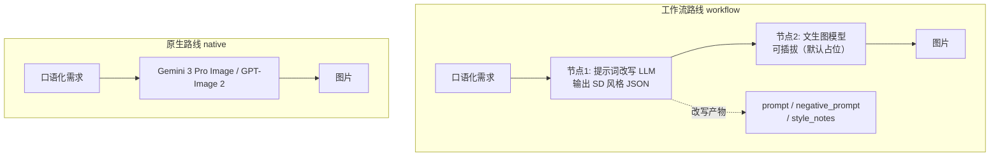

# image-gen-workflow —— 文生图工作流 vs 原生图像生成（本地仿真）

对应官方实验 1-4：同一句口语化需求走两条路线，对照"工作流（改写→生图）"与"原生（直接出图）"。

本仓库为 **TypeScript 本地仿真版**：改写节点用 **Ollama gemma4**（真实跑），生图节点做成**可插拔**（默认占位）。无需云端 API Key。

## 这个实验在学什么

**核心：工作流路线的"节点编排"，特别是改写节点的行为。**

官方实验的两条路线：



**改写节点做的是"翻译"不是"决策"**：把自然语言适配成文生图模型能消化的输入。两个考察维度：

| 需求类型 | 考察点 | 例子 |
| --- | --- | --- |
| 具体需求 | **忠实度**——改写会不会弄丢/篡改用户给定信息 | "风格丧一点" → 会不会丢"丧"？ |
| 宽泛需求 | **信息增益**——改写替用户想象了什么画面 | "AGI 实现后的程序员" → 具象化成什么样？ |

## 快速开始

```bash
# 前提：Ollama 运行 + 本地对话模型（.env 的 MODEL_NAME）

npm install
npm run workflow                 # 全部 5 句需求跑工作流路线
npm run workflow -- <id>         # 跑指定需求（如 agi-programmer）
npm run rewrite -- "一句话"      # 只测改写节点
```

## 目录结构

```
4.image-gen-workflow/
├── src/
│   ├── main.ts            # 5 句需求 + 对照分析
│   ├── pipeline.ts        # 工作流路线编排（改写→生图，代码写死）
│   ├── rewriter.ts        # 改写节点（Ollama，忠实还原官方 REWRITE_SYSTEM_PROMPT）
│   └── image-generator.ts # 生图节点可插拔接口（占位 + 接口）
└── .env.example           # Ollama 配置
```

## 核心实现讲解

### 1. 改写节点（rewriter.ts）

忠实还原官方的 `REWRITE_SYSTEM_PROMPT`：让模型输出 SD 风格 JSON。用 Ollama 实现：

```ts
// 系统提示词要求模型只输出一个 JSON 对象：
// {"prompt": "...", "negative_prompt": "...", "style_notes": "..."}
const out = await rewritePrompt('帮我画一个周末加班的程序员，风格丧一点');
// prompt: masterpiece, best quality, ..., a weary programmer, ..., melancholic atmosphere, ...
// style_notes: 我将"丧"的情绪通过...具象化
```

`parseRewriteOutput` 容忍 ```json 代码围栏和前后多余文字（对应官方同函数）。

### 2. 生图节点可插拔（image-generator.ts）

```ts
export interface ImageGenerator {
  readonly name: string;
  generate(prompt: string, negativePrompt: string): Promise<GeneratedImage>;
}
// 默认 PlaceholderGenerator：不真出图，记录 prompt + 模拟元数据
// 接入真实现：实现 ImageGenerator 接口，在 createImageGenerator 注册即可
```

**为什么可插拔？** 本实验教学价值在"工作流编排 + 改写行为"，不依赖真图。占位实现让你今天就能学到核心；以后有生图后端时，填一个实现类即可，流程代码不用动。

### 3. 工作流编排（pipeline.ts）

```ts
// 执行路径代码写死：先改写，后生图
const rewrite = await rewritePrompt(requirement);       // 节点 1
const image = await generator.generate(rewrite.prompt,  // 节点 2
                                       rewrite.negative_prompt);
```

每次节点调用都记录到 `nodes`（模型、输入、输出），便于对照分析。

### 4. 对照观察（main.ts 的自动分析）

工作流跑完后，`main.ts` 按需求类别自动给出对照结论——这就是实验考察点的代码化：

```ts
if (req.category === 'specific') {
  // 具体需求 → 考察忠实度：每条需求各带一个"关键细节"和英文关键词正则，
  // 检查改写后的 prompt 有没有把它翻译保留（gemma 会用专业 SD 词而非原词）
  const ok = req.keyRegex?.test(result.rewrite.prompt) ?? false;
  console.log(`  提示词保留"${req.keyDetail}": ${ok}`);
} else {
  // 宽泛需求 → 考察信息增益：直接展示 style_notes（改写自己说明替用户想象了什么）
  console.log('  style_notes 里改写说明的增补: ' + result.rewrite.style_notes);
}
```

REQUIREMENTS 里为每条具体需求配了 `keyDetail` + `keyRegex`：

| 需求 | keyDetail | keyRegex 检测什么 |
| --- | --- | --- |
| 加班程序员 | 丧 | `melancholic` / `weary` / `tired` / `gloomy` … |
| 窗台绿植 | 早晨阳光 | `golden hour` / `god rays` / `volumetric` / `sunlight` … |
| 降噪耳机海报 | 深夜清净+简约 | `night` / `dark` / `serene` / `minimal` … |

注意：这是**启发式检测**（按关键词判断），LLM 改写输出每次略有差异，偶尔可能误报/漏报，适合教学展示，不适合当严谨评测。

## 运行实例记录

### 实例 1：自定义测试（`npm run rewrite`）

`rewrite` 命令可测**任意口语化句子**。例如：

```bash
npm run rewrite -- "在阳台上慵懒晒着太阳的大胖橘猫"
```

实测输出（gemma4）：

```
prompt:  masterpiece, best quality, photorealistic, a chubby orange tabby cat,
         lounging lazily on a sun-drenched balcony, golden hour light, ...
negative_prompt:  lowres, worst quality, blurry, ... plastic, illustration, cartoon
style_notes:  我强调了"摄影级真实感"和"金色时刻"的光影效果，将"慵懒"具象化为
              放松的姿态和柔和的光影，同时补充了阳台环境的背景细节（如热带植物）
```

**观察点：** "慵懒"→ `lounging lazily`、"晒太阳"→ `sun-drenched balcony` + `golden hour light`。改写节点把口语的情绪/场景转成了具体的摄影术语——即使是新句子也一样工作。

### 实例 2：完整工作流运行（`npm run workflow`，真实记录）

`npm run workflow` 依次跑 5 句需求，每句打印 **节点 1（改写）→ 节点 2（生图）→ 对照观察**。这是实测输出（gemma4 真实改写，生图节点占位）：

```
[programmer-overtime] (specific) 帮我画一个周末加班的程序员，风格丧一点

── 节点 1：提示词改写 ──
  prompt:           masterpiece, best quality, highly detailed, a young tired programmer,
                   melancholic gaze, working overtime late night, illuminated by monitor
                   screen glow, messy desk, empty coffee cups, streams of code ...
  negative_prompt:  lowres, worst quality, bad anatomy, bad hands, extra limbs, blurry,
                   jpeg artifacts, visible text, cheerful, bright sunlight, cartoon, oversaturated
  style_notes:      我将'丧'的概念转化为视觉美学，重点使用了'melancholic'（忧郁）、
                   'lo-fi aesthetic'（低保真美学）和'cyberpunk melancholy'（赛博朋克式忧郁）。
                   通过强调'monitor screen glow'、'deep shadows'营造深夜、压抑的氛围。

── 节点 2：文生图 ──
  generator: placeholder
  note: 占位实现：未真正生图（改写后的 prompt 见下）

── 对照观察 ──
  [具体需求 → 考察忠实度] 用户明确的细节是否被改写保留?
  提示词保留"丧": true
```

其他 4 句输出结构相同，节选关键字段：

```
[windowsill-plant] (specific) 帮我画一盆放在窗台上的绿植，早晨的阳光刚好照进来
  prompt:        hyperdetailed photograph, lush potted houseplant, succulent arrangement,
                 placed on a rustic windowsill, golden hour sunlight, volumetric light rays,
                 sun dappling through the leaves ...
  style_notes:   我强调了'黄金时段'（Golden Hour）和'体积光'（Volumetric Light）...
  提示词保留"早晨阳光": true

[headphone-poster] (specific) 帮我做一张新款降噪耳机的产品海报，主打"深夜独处也清净"...
  prompt:        masterpiece, best quality, ultra-detailed, luxury product advertisement,
                 overhead studio shot, noise-canceling headphones, sleek design,
                 minimalist aesthetic, dark moody atmosphere, soft ambient light ...
  style_notes:   强调了"产品摄影"和"简约高级感"的核心，通过深色背景、环境光、散景
                 营造深夜宁静、高端、极简主义的氛围...
  提示词保留"深夜清净+简约": true

[agi-programmer] (broad) 帮我画一个 AGI 实现以后程序员的工作场景
  prompt:        ... a thoughtful programmer, sitting in a sleek, futuristic minimalist
                 office, interacting with holographic interfaces ...
  style_notes:   将传统的写代码场景升级为"超维数据可视化"的沉浸式环境，使用
                 'holographic interface'和'advanced AI visualization'表现AGI的介入感...
  [宽泛需求 → 考察信息增益] style_notes 里改写说明的增补: ...

[future-city-morning] (broad) 帮我画一幅"未来城市的早晨"的画
  prompt:        ... sprawling futuristic metropolis, towering skyscrapers,
                 golden hour sunrise, ethereal morning fog, aerial perspective ...
  style_notes:   将关键词'早晨'具象化为'日出时的黄金时刻'和'晨雾'，画风提升至
                 电影级、超写实的科幻概念艺术...
  [宽泛需求 → 考察信息增益] style_notes 里改写说明的增补: ...
```

> 注意：LLM 改写每次输出会略有差异（即使 temperature=0），字段措辞不同但规律一致。

## 实测结果（gemma4 真实改写）

| 需求 | 类别 | 改写后的关键行为 | 自动检查 |
| --- | --- | --- | --- |
| 周末加班的程序员，风格丧一点 | specific | "丧"→ `melancholic` / `lo-fi aesthetic` / `cyberpunk melancholy`，用"深夜 + 屏幕冷光"烘托压抑（**保留**情绪，但换了更专业的 SD 词） | 保留"丧": **true** |
| 窗台绿植，早晨阳光 | specific | 阳光→ `golden hour` / `volumetric light rays` / `sun dappling`（保留细节 + 增强光影术语） | 保留"早晨阳光": **true** |
| 降噪耳机海报 | specific | 文案→ `dark moody atmosphere` / `minimalist aesthetic` / `product advertisement`（把"深夜清净+简约"转成视觉元素） | 保留"深夜清净+简约": **true** |
| AGI 实现后的程序员 | broad | **具象化**为"极简未来办公室 + 全息界面 + 超维数据可视化"，强调人与 AI 协作而非写代码 | 信息增益: style_notes 展示 |
| 未来城市的早晨 | broad | **具象化**为"golden hour 日出 + 晨雾 + 电影级超写实科幻"，鸟瞰全景 | 信息增益: style_notes 展示 |

**对照结论（这就是实验的核心发现）：**
- **具体需求**：改写**忠实**——用户明确信息（情绪/物品/文案）被翻译保留，但会用更专业的 SD 术语表达（"丧"→ melancholic），这是"翻译"的代价，也是忠实度考察的难点
- **宽泛需求**：改写**具象化**——替用户想象了大量画面细节（AGI 场景 → 全息界面未来办公室），这是原生路线直接出图所没有的"叙事性"

## 注意事项 / 常见问题

- **Ollama 必须已运行**：`OLLAMA_BASE_URL` 连不上会直接报 `Ollama HTTP 000`。先 `ollama serve`，再 `ollama pull gemma4:latest`（或改 `.env` 的 `MODEL_NAME` 用你本地已有的模型，如 `llama3.2`）。
- **改写输出有随机性**：即使 `temperature: 0`，gemma4 每次措辞也会有差异（换词但语义一致）。README 里的输出是"代表性记录"，不是精确复现。
- **忠实度是启发式判断**：`main.ts` 用关键词正则检测（如 `melancholic`/`weary` 判"丧"），LLM 偶尔会换同义词导致误判，看真实输出时以 `style_notes` 的自我说明为准。
- **生图节点默认占位**：不真出图是设计使然，学的是"编排 + 改写"，不是出图质量。

## 参考

- 官方实验：https://github.com/bojieli/ai-agent-book/tree/main/chapter1/image-gen-workflow