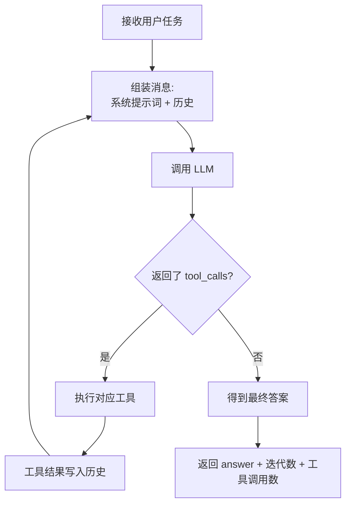
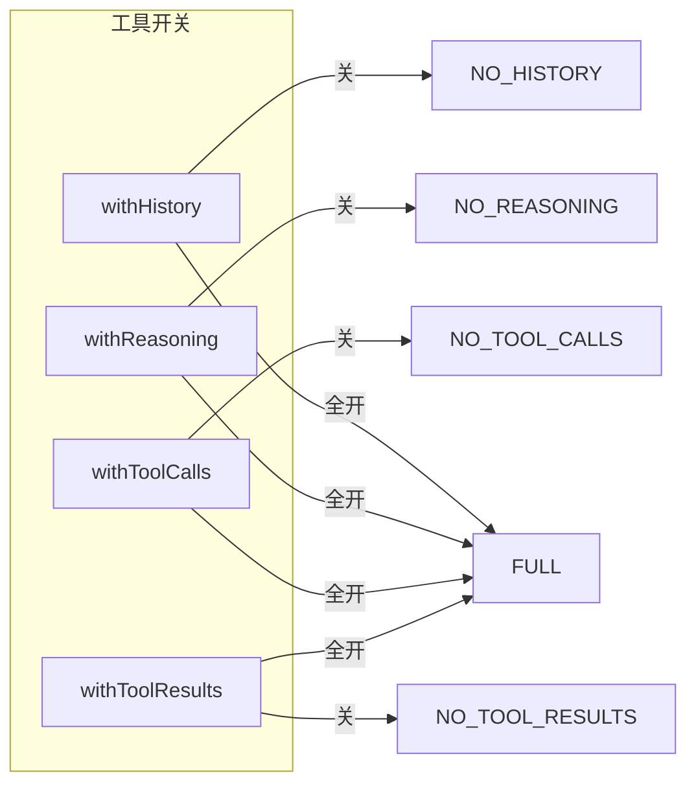
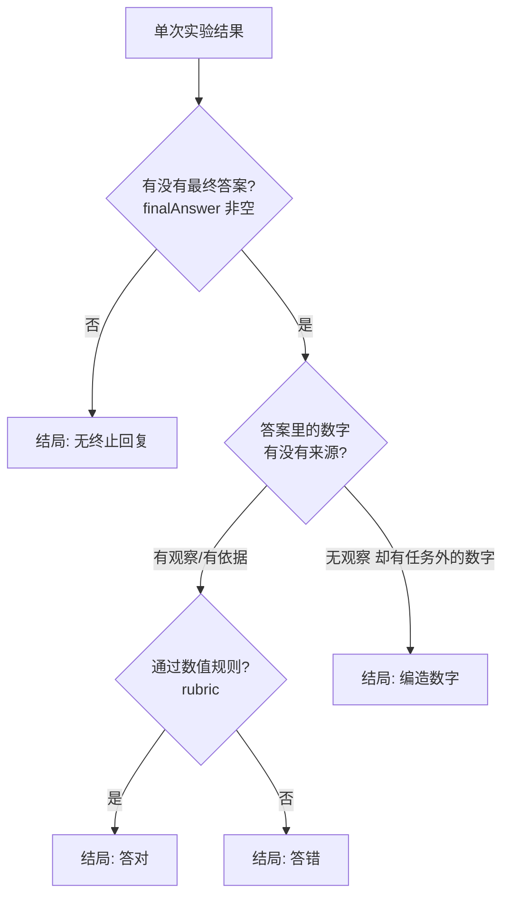
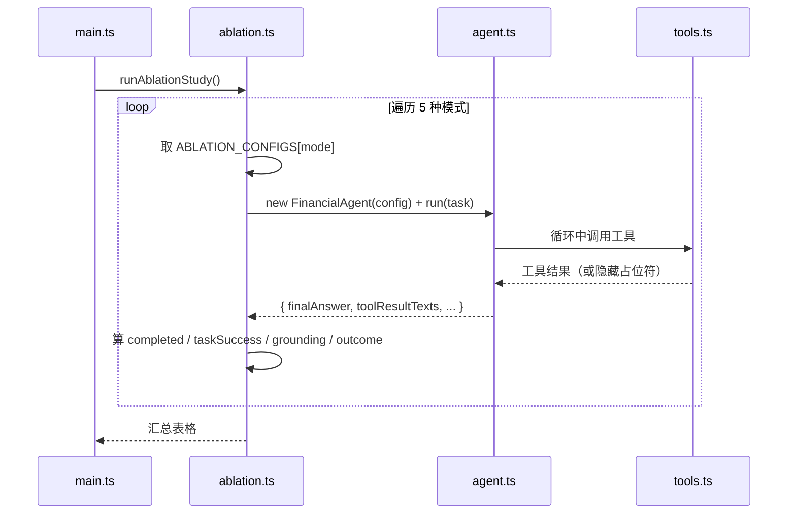

# Chapter 1：上下文感知 Agent 与消融实验

一个基于 LangChain + Ollama 的教学项目，实现了一个"会调用工具的财务分析 Agent"，并用 **5 种消融模式（Ablation Study）** 验证"历史记录、推理、工具调用、工具结果"四种上下文能力对 Agent 完成任务的影响。

对应《AI Agent 开发实战》第 1 章实验。

---

## 1. 环境准备

| 依赖 | 版本要求 | 说明 |
| --- | --- | --- |
| Node.js | ≥ 22 | 使用了 `process.loadEnvFile`（Node 20.12+ 可用） |
| Ollama | 任意 | 本地跑 LLM，默认 `gemma4:latest` |
| pnpm / npm | 任意 | 安装依赖用 |

```bash
# 1. 安装依赖
npm install   # 或 pnpm install

# 2. 配置 .env（参考示例）
cp .env.example .env   # 若还没有该文件，手动创建：
# OLLAMA_BASE_URL=http://localhost:11434
# MODEL_NAME=gemma4:latest

# 3. 确认 Ollama 有对应模型
ollama pull gemma4:latest
```

> 没有 `gemma4` 就换成任意本地模型（如 `qwen2.5:7b`），改 `.env` 里的 `MODEL_NAME` 即可。

---

## 2. 快速开始

项目有 3 种运行模式，入口统一是 `src/main.ts`。安装依赖后，两种等价写法任选：

- `npm run <模式>`（推荐，不依赖 npx/全局工具）
- `npx tsx src/main.ts <模式>`（等价的 npx 写法）

```bash
# 模式一：交互模式（推荐上手）—— 和 Agent 对话，含 5 个内置示例任务
npm run interactive
# 等价: npx tsx src/main.ts interactive

# 模式二：消融实验（项目核心）—— 依次跑完 5 种模式并输出对比表
npm run ablation
# 等价: npx tsx src/main.ts ablation

# 模式三：单次实验 —— 只跑一种模式
npm run single -- full
# 等价: npx tsx src/main.ts single full
```

### 交互模式支持的命令

```
samples          - 查看 5 个内置示例任务
sample <n>       - 运行第 n 个示例任务（sample 2 = PDF 财务分析）
create_pdfs      - 下载样例 PDF 到 fixtures/pdfs/
modes / mode <name>  - 查看 / 切换消融模式
reset            - 重置会话
status           - 查看当前配置（模型 / 模式 / 会话长度）
help / quit      - 帮助 / 退出
```

---

## 3. 目录结构

```
chapter1/
├── src/
│   ├── main.ts        # CLI 入口：交互 / 消融 / 单次 三种模式
│   ├── types.ts       # 核心类型：ContextMode、AblationConfig、ExperimentResult
│   ├── agent.ts       # FinancialAgent：思考-行动-观察 主循环
│   ├── tools.ts       # 4 个工具：计算器 / 汇率 / PDF / 代码解释器
│   ├── ablation.ts    # 消融配置 + 实验运行 + 结果判定（rubric）
│   ├── grounding.ts   # 数字来源判定（答案的数字有没有依据）
│   ├── samples.ts     # 5 个内置示例任务
│   └── pdfs.ts        # 样例 PDF 下载（create_pdfs 命令）
├── fixtures/pdfs/     # 样例 PDF（2 个，供 sample 2 使用）
├── ablation-results.md # 一次实际消融实验的结果报告（示例）
├── .env               # 本地配置（模型名 / Ollama 地址）
└── package.json
```

---

## 4. 核心概念讲解

### 4.1 Agent 的"思考-行动-观察"循环（ReAct）

`src/agent.ts` 的核心是 `FinancialAgent.run()`，它在一个 `while` 循环里反复执行三件事：

1. **思考**：把"历史 + 系统提示词"发给 LLM
2. **行动**：如果 LLM 返回 `tool_calls`，就执行对应工具，把结果塞回历史
3. **观察**：带着新观察继续下一轮，直到 LLM 不再请求工具（给出最终答案）



如果循环超过 `maxIterations = 10` 次仍没停下，就视为"达到最大迭代次数"，`finalAnswer = null`。

### 4.2 Agent 手里的 4 个工具（`src/tools.ts`）

| 工具 | 用途 | 说明 |
| --- | --- | --- |
| `calculator` | 数学计算 | 基于 mathjs，禁止模型心算 |
| `convert_currency` | 汇率换算 | 真实免费 API；失败时用备用汇率 7.2 |
| `parse_pdf` | 读本地 PDF | 返回前 2000 字符，防止上下文爆炸 |
| `code_interpreter` | 执行 JS 代码 | 用 `node:vm` 隔离沙箱，防止逃逸 |

### 4.3 消融实验：5 种模式（`src/ablation.ts`）

消融 = "把能力一个个拆掉，看哪个最重要"。4 个开关组合出 5 种配置：

| 模式 | withHistory | withReasoning | withToolCalls | withToolResults | 意味着 |
| --- | :-: | :-: | :-: | :-: | --- |
| `full` | ✅ | ✅ | ✅ | ✅ | 完整能力（基线） |
| `no_history` | ❌ | ✅ | ✅ | ✅ | 每轮只发"系统 + 最新用户消息"，忘记历史 |
| `no_reasoning` | ✅ | ❌ | ✅ | ✅ | 禁止 `<thought>` 思考过程 |
| `no_tool_calls` | ✅ | ✅ | ❌ | ✅ | 不绑工具，模型只能"心算" |
| `no_tool_results` | ✅ | ✅ | ✅ | ❌ | 工具执行了，但结果对模型隐藏 |



### 4.4 结果怎么判定（重要！）

消融实验跑完，每条结果用 **3 个独立维度** 描述（对应参考实现 `bojieli/ai-agent-book` 的思路）：



**三者的区别：**

- **`completed`**（完成）：只是"模型给了一段最终回答"，**不代表答对**。`no_tool_calls` 模式第一轮就必然回复，所以它"完成"但没答对。
- **`groundingVerdict`**（数字依据）：答案里的大额数字，是否出现在"任务文本"或"模型真正看到的工具结果"里。`no_tool_results` 的答案数字没有来源 → `ungrounded`（编造）。
- **`taskSuccess`**（数值规则 rubric）：是否满足任务专属的答案判定。对当前财务任务，从工具观察里**动态提取实际汇率**，计算期望的"同比增速 / Q2 折人民币 / 总营收"，再和答案比对。

> 为什么 rubric 不硬编码期望值？因为汇率是**实时 API** 返回的（可能不是 7.2）。硬编码会导致真实汇率下"算对的答案被判错"。所以期望值从观察里现算。

判定逻辑分散在两个文件：
- `grounding.ts`：`assessGroundedness()` 判断数字有没有来源
- `ablation.ts`：`canonicalAnswerCorrect()` 判断答案数值对不对，`armOutcome()` 合并成结局标签

### 4.5 一次消融实验的完整流程



---

## 5. 建议学习路径（从零开始）

如果你刚接触 Agent，按这个顺序读代码，**由外到内**：

1. **先跑起来**：`npm run interactive`（或 `npx tsx src/main.ts interactive`），输入"帮我算 15×23"，看 Agent 怎么调计算器。再跑 `npm run ablation` 看 5 种模式的结果差异。
2. **读 `types.ts`**：先认识核心概念——`ContextMode`（模式）、`AblationConfig`（4 个开关）、`ExperimentResult`（结果的结构）。这是全项目的"词汇表"。
3. **读 `agent.ts`**：理解主循环（第 4.1 节）。重点看 4 处 `【消融点 N】` 注释，它们就是 4 个开关的实现位置。
4. **读 `tools.ts`**：看工具怎么用 zod 定义入参、怎么注册给 LLM。
5. **读 `ablation.ts`**：看实验怎么编排、结果怎么判定（第 4.4 节）。
6. **读 `grounding.ts`**（进阶）：理解"数字有没有依据"这个判断，这是本项目对"完成 ≠ 答对"的修正。
7. **挑战自己**：
   - 把 `EXPERIMENT_TASK` 换成一个新任务，想想 rubric 要怎么写？
   - 加第 5 个消融开关（比如"无 PDF 工具"），会是什么效果？
   - 用 `no_tool_results` 模式跑一次，观察 Agent 是怎么"瞎猜"的。

---

## 6. 常见问题（FAQ）

**Q：为什么 `no_tool_calls` 只迭代 1 次就"完成"了？**
因为没有工具可调，模型第一轮就直接回复——`completed` 只表示"有终止回复"，不代表答对。这正是消融要展示的现象。

**Q：为什么之前答案摘要看起来是 JSON / 带了 `tool_calls`？**
早期版本 `agent.ts` 里给 `ChatOllama` 配了 `format: 'json'`，会把模型输出包装成 JSON。该配置对工具调用场景有害，已移除。若你本地又遇到类似现象，检查是否重新加了该参数。

**Q：汇率一会儿是 7.2 一会儿是别的？**
7.2 只是网络失败时的备用值；正常会请求 `open.er-api.com` 的实时汇率。

**Q：`create_pdfs` 命令联网下载失败怎么办？**
PDF 也可以自己造：任意本地 PDF 放到 `fixtures/pdfs/` 下，改 `src/samples.ts` 里的路径即可。

**Q：为什么结果里 grounding 显示"已看工具"但结局是"答错"？**
看到工具 ≠ 答对。`not_assessable` 表示"模型看到了真实观察，无法仅凭文本判断数字是否编造"，此时正确性完全交给 rubric 裁决。

---

## 7. 参考资源

- 参考实现（Python 原版）：https://github.com/bojieli/ai-agent-book/tree/main/chapter1/context
- LangChain：https://js.langchain.com/
- Ollama：https://ollama.com/