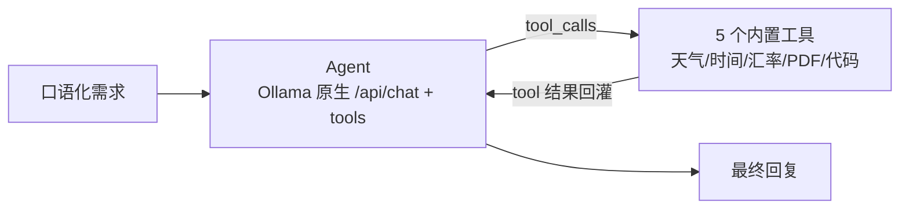

# local-llm-serving —— 本地 LLM 服务部署与工具调用（TypeScript 移植版）

对应官方实验 2-1 ★：**本地 LLM 服务部署与工具调用**（`chapter2/local_llm_serving`）。

本仓库为 **TypeScript 移植版**：用 Ollama 原生 `/api/chat` 工具调用协议实现一个跨工具 Agent，内置 5 个工具（天气 / 时间 / 汇率 / PDF / 代码解释器），支持单任务与交互模式、流式输出（含思考过程）。无需云端 API Key。

## 这个实验在学什么

**核心：本地 LLM 服务 + 标准工具调用（OpenAI 兼容格式）的完整闭环。**

实验 2-1 的关键点，官方有两条服务端路径：

| 后端 | 适用平台 | 说明 |
| --- | --- | --- |
| **vLLM** | Linux/WSL2 + NVIDIA GPU | 需额外安装 `vllm` extra |
| **Ollama** | macOS / 原生 Windows / 无 GPU 的 Linux | 本移植只实现这条路径 |



四个值得动手验证的机制：

1. **thinking 字段 vs `<thinking>` 标签**：模型原始 token 流里是 `<thinking>` 标签，Ollama 在交给客户端前解析成独立的 `thinking` 字段。`think=true` 探测，不支持思考的模型（HTTP 400）自动回退。
2. **流式 ReAct 循环**：一次对话里模型可能多次调用工具，每次结果回灌后继续决策，直到不再调用工具。
3. **并行工具调用**：同一轮生成的多个工具调用互相独立，一次性并发执行、按序回灌。
4. **工具结果必须是真实数据**：Agent 的回复是否真的基于工具返回值，而不是模型编造。

## 快速开始

```bash
# 前提：Ollama 运行 + 支持工具调用的模型（默认 gemma4:latest）

npm install
cp .env.example .env   # 可选，默认值已可用

npm run demo                             # 跑第一个样例任务（快速验证）
npm run single -- "一句话任务"            # 单任务模式（流式）
npm run single -- --no-stream "任务"      # 单任务模式（非流式）
npm run interactive                      # 交互模式
npm run info                             # 环境与工具信息
```

交互模式内建命令：`/reset` `/tools` `/samples` `/sample <n>` `/stream` `/help` `/exit`

## 目录结构

```
1.local-llm-serving/
├── src/
│   ├── main.ts            # CLI 入口（单任务/交互/信息 + 流式渲染）
│   ├── agent.ts           # OllamaNativeAgent：think 回退 + 流式 ReAct 循环
│   ├── tools.ts           # ToolRegistry + 5 个内置工具实现
│   └── samples.ts         # 官方 7 个样例任务（由简到繁）
├── package.json
└── .env.example           # Ollama 配置
```

## 核心实现讲解

### 1. 工具注册表（tools.ts）

每个工具 = `name + description + parameters(JSON Schema) + fn`，schema 是 **OpenAI 兼容格式**，Ollama 原生 `/api/chat` 直接接收同一格式：

```ts
registry.register(
  'get_current_temperature',
  "Get the current temperature for a specific location",
  {
    type: 'object',
    properties: { location: { type: 'string' }, unit: { type: 'string', enum: ['celsius','fahrenheit'] } },
    required: ['location'],   // unit 有默认值 celsius，不必填
  },
  getCurrentTemperature
);
```

5 个内置工具（对应官方 tools.py）：

| 工具 | 说明 | 数据来源 |
| --- | --- | --- |
| `get_current_temperature` | 城市实时天气 | Open-Meteo（无需 Key） |
| `get_current_time` | 时区当前时间 | Intl（IANA 时区 + 常见缩写映射） |
| `convert_currency` | 汇率换算 | 模拟汇率表 |
| `parse_pdf` | 提取 PDF 文本 | URL 或本地文件（pdf-parse） |
| `code_interpreter` | 执行 Python 代码 | spawn `python3` 子进程 |

> `code_interpreter` 保持官方语义：模型生成的是 **Python**，所以用 `python3` 子进程执行，捕获 stdout 并抽取 `result` 变量。`^` 是 Python 的按位异或，不是幂运算（幂用 `**`），这点写进了工具描述。

### 2. think 回退（agent.ts）

支持思维链的模型（qwen3、gemma4 等）传 `think=true`，思考内容走独立的 `thinking` 字段；不支持的模型（llama3.2、qwen2.5 等）对 `think=true` 返回 HTTP 400。回退逻辑每个模型只探测一次并缓存：

```ts
private async chatWithThinkFallback(body): Promise<Response> {
  if (this.thinkDisabled.has(this.model)) return this.chatOnce(body);
  try {
    return await this.chatOnce({ ...body, think: true });
  } catch (e) {
    if (e instanceof OllamaError && e.status === 400) {
      this.thinkDisabled.add(this.model);   // 不支持思考
      return this.chatOnce(body);           // 去掉 think 重试
    }
    this.thinkDisabled.add(this.model);     // 未知错误也回退
    return this.chatOnce(body);
  }
}
```

### 3. 流式 ReAct 循环（agent.ts）

`chatStream` 产出四种 chunk，直到模型不再调用工具（最多 10 轮）：

```ts
// 伪代码：一轮 = 流式读完 → 有工具调用？执行并回灌，再问一轮；否则结束
while (iteration < maxIterations) {
  for await (const chunk of readNdjson(streamResponse)) {
    // thinking / tool_call / content 逐块 yield
  }
  if (pendingToolCalls.length) {
    history.push(assistant);          // 保留本轮 assistant 消息（含 tool_calls）
    const results = await Promise.all(toolCalls.map(execute)); // 并行执行
    for (const r of results) {
      yield { type: 'tool_result', content: r };
      history.push({ role: 'tool', tool_name, content: r });   // 结果回灌
    }
    // 继续循环，让模型基于结果决策
  } else break;
}
```

关键点：
- **assistant 消息必须带 `tool_calls`**，工具结果用 `role: 'tool'` + `tool_name`，这是 Ollama 多轮工具调用约定的消息结构。
- **并行执行用 `Promise.all`**，顺序保持（对齐官方 `ThreadPoolExecutor`）。
- 流式响应是 **NDJSON**，逐行 `JSON.parse`；新版本 Ollama 的 `/api/chat` **默认 `stream=true`**，非流式路径必须显式传 `stream: false`。

### 4. 思考内容到底在哪里

官方 README 专门讲了这个坑：模型原始 token 流里是 `<thinking>` 标签，但 Ollama 解析后放到独立的 `thinking` 字段，`content` 里看不到。本项目两种都处理：

- **`message.thinking`**（常规路径）：`chatStream` 直接读它，yield 成 `thinking` chunk；
- **`content` 里的内联 `<thinking>`**（兜底路径）：`splitInlineThinking` 拆出来重新归类。

## 运行实例记录（gemma4 真实调用）

### 实例 1：流式 + 工具调用（时间查询）

`npm run single -- "What is the current time in Vancouver?"`

```
🧠 Thinking: 1. Analyze the Request... 2. Examine Available Tools...
🔧 Tool Calls:
  → get_current_time: {"timezone":"America/Vancouver"}
    ✓ {"timezone":"America/Vancouver","datetime":"2026-09-08 01:56:00",...}
🤖 Assistant: The current time in Vancouver is Tuesday, September 8, 2026,
              at 01:56:00 (UTC-07:00).
```

### 实例 2：并行工具调用（两个城市）

`npm run single -- "What's the current time in Tokyo and New York?"`

同一轮模型发出两个 `get_current_time` 调用，并行执行后一起回灌：

```
🔧 Tool Calls:
  → get_current_time: {"timezone":"Asia/Tokyo"}
  → get_current_time: {"timezone":"America/New_York"}
    ✓ {"timezone":"Asia/Tokyo","datetime":"2026-09-09 11:42:12",...}
    ✓ {"timezone":"America/New_York","datetime":"2026-09-08 22:42:12",...}
🤖 Assistant: Tokyo: Wednesday, September 9, 2026, 11:42:12 AM (JST, UTC+9)
              New York: Tuesday, September 8, 2026, 10:42:12 PM (EDT, UTC-4)
```

### 实例 3：代码解释器（复利计算）

`npm run single -- "Calculate the compound interest on $5000 invested at 6% annual interest rate for 30 years, compounded monthly."`

模型生成 Python 代码 → `python3` 执行 → 结果回灌 → 生成最终答复。未来值 **$30,112.88**（`5000 × (1 + 0.06/12)^360`），数值正确且基于工具返回值。

### 实例 4：天气查询（外部 API）

`npm run single -- "What's the weather like in Tokyo right now?"`

```
→ get_current_temperature: {"location":"Tokyo"}
  ✓ {"location":"Tokyo, Japan","temperature":29.4,"unit":"°C","conditions":"light drizzle","humidity":83,...}
🤖 Assistant: The weather in Tokyo, Japan right now is 29.4°C with light drizzle.
              Humidity: 83%, Wind Speed: 10 km/h
```

## 注意事项 / 常见问题

- **Ollama 必须已运行**：`ollama serve`；模型不存在会提示 `ollama pull gemma4:latest`。
- **模型工具调用能力**：gemma4:latest 可用；换成 `llama3.2:1b` 这类小模型，工具调用质量明显下降（可能调用了工具却读不懂结果）。实验建议用支持工具调用的 8B 级模型（qwen3:8b / llama3.1-3.2 8b / gemma4）。
- **`unit` 不是必填**：天气工具的 `unit` 默认 celsius。若设成必填，gemma4 会反问"要摄氏度还是华氏度"而不是直接调工具。
- **新版本 Ollama 默认流式**：`/api/chat` 不带 `stream` 时默认 `stream=true`，非流式必须显式 `stream: false`，否则会拿到 NDJSON 导致解析错误。
- **code_interpreter 依赖 python3**：本机需要能跑 `python3 -c`；没有的话该工具返回错误，但不影响其余工具。
- **并行调用有上限**：一轮多个工具调用会并发执行，注意别一次让模型发几十个（会打爆 API）。

## 参考

- 官方实验：https://github.com/bojieli/ai-agent-book/tree/main/chapter2/local_llm_serving
- 官方讲义：https://bojieli.github.io/ai-agent-book/chapter2/local_llm_serving/
- Ollama API：https://github.com/ollama/ollama/blob/main/docs/api.md
- Open-Meteo：https://open-meteo.com/