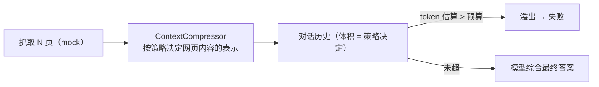

# context-compression —— 上下文压缩策略对比（TypeScript + Ollama）

对应官方实验 2-10 ★★★：**上下文压缩策略对比**（`chapter2/context-compression`）。

本仓库为 **TypeScript 移植版**：以"调研 OpenAI 联合创始人当前职业归属"为任务，用 Ollama gemma4 对比 **6 种上下文压缩策略**的 token 体积、压缩比、溢出与信息保留。搜索用本地 mock 数据，摘要用 Ollama 完成，`CONTEXT_WINDOW_SIZE` 预算故意收紧使溢出可观察。

## 这个实验在学什么

**核心：上下文窗口变大时，如何高效管理上下文——降成本（token）、降延迟、降溢出、保相关性。** 6 种策略各有权衡：

| 策略 | 做法 | 特点 |
| --- | --- | --- |
| `no_compression` | 网页原文直接进上下文 | 基线：体积暴涨，**溢出失败** |
| `individual` | 每页单独 LLM 摘要再拼接 | 保留页级细节，摘要调用多 |
| `combined` | 全部页合并后一次摘要 | 全局观好，可能丢页级归属 |
| `context_aware` | 结合研究问题做聚焦摘要 | 相关性最好，token 最省 |
| `citations` | context_aware + 来源链接 | 利于追问，稍大 |
| `windowed` | 最近一次保留全文，更早历史压缩 | 细节与效率折中 |



## 快速开始

```bash
# 前提：Ollama 运行 + gemma4:latest

npm install
npm run experiment                # 6 策略对比表 + JSON + HTML（约 2-3 分钟）
npm run run -- --strategy context_aware   # 单策略
npm run run -- --window 6000      # 收紧预算看溢出
npm run report                    # 离线汇总 runs/
```

可调参数（.env 或 CLI）：`CONTEXT_WINDOW_SIZE`（预算，默认 8000）、`MAX_WEBPAGE_LENGTH`（单页字符，默认 5000）、`SUMMARY_MAX_TOKENS`（摘要上限，默认 600）。

## 目录结构

```
10.context-compression/
├── src/
│   ├── main.ts        # 实验 runner：对比表 + JSON + HTML 报告
│   ├── agent.ts       # ResearchAgent：确定性抓取计划 + token 计量 + 溢出
│   ├── compressor.ts  # ContextCompressor：6 策略 + LLM 摘要（记忆化）
│   └── mock.ts        # mock 搜索/网页数据（8 位联创）
├── runs/              # 实验结果 + report.html（gitignore）
├── package.json
└── .env.example       # OLLAMA_BASE_URL / 预算配置
```

## 核心实现讲解

### 1. 压缩器（compressor.ts）

每种策略决定"网页内容以什么形态进历史"，摘要用 Ollama、按页数记忆化避免重复调用：

```ts
case 'combined': {
  const all = pages.map(p => p.text).join('\n\n');
  const summary = await memoizedSummarize('combined', n, all, '合并总结这些网页...');
  messages.push({ role:'tool', content: `[合并摘要] ${summary}` });
}
```

批量策略（combined/context_aware/citations）只在最终上下文中算一次摘要；逐页策略（individual/windowed）逐页摘要。

### 2. 溢出检测（agent.ts）

token 估算 = `字符数 / 3.5`；每次抓页后估算历史总量，超 `CONTEXT_WINDOW_SIZE` 即溢出：

```ts
if (tokens > this.opts.contextWindowTokens) { overflows++; error = `溢出...`; break; }
```

`no_compression` 保留全部原文 → 必然超预算失败；压缩策略体积骤降 → 完成。

### 3. 确定性抓取计划

为了让对比聚焦"压缩本身"而非模型自主搜索的不确定性，实验按固定顺序抓全部 8 位联创的页面（mock），模型只负责压缩摘要与最终综合。压缩后的上下文以 `user` 消息进历史（脚本化抓取没有真实 tool_calls，`tool` 消息会被模型忽略）。

## 实测结果（gemma4:latest，预算 8000 tok，抓取 8 页）

```
Strategy              Succ  Iters  Tokens   Compress  Overflows  SumCalls  #Cofounders
--------------------------------------------------------------------------------------
no_compression       ✗      6      8914     100.0%         1         0          0
individual           ✓      8       567       3.7%         0         8          8
combined             ✓      8       211       0.8%         0         1          3
context_aware        ✓      8       184       0.6%         0         1          3
citations            ✓      8       201       0.7%         0         1          8
windowed             ✓      8      1918      15.2%         0         7          8
```

**解读（与官方定性预期一致）：**

- **no_compression 按设计溢出失败**——第 6 页后累计 8914 tok 超预算，这就是"无压缩"的基线问题。
- **context_aware 最省 token（184 tok，0.6%）**——结合查询聚焦摘要，几乎只有一条摘要的体积。官方同样把它评为 token 最省。
- **combined 更省但丢信息（211 tok，只保留 3/8 人名）**——合并摘要强压缩的代价。
- **individual 逐页摘要信息最全（8/8）但摘要调用最多（8 次）**——页级细节保留。
- **citations 体积略大（201 tok）但 8/8 信息全 + 带来源**——利于追问。
- **windowed 体积最大（1918 tok，15.2%）但信息全**——保留最近全文、压缩更早历史，是长对话的折中。

> ⚠️ 单次运行绝对值会波动；相对排序（无压缩溢出 < 压缩后完成 < 各策略体积/信息权衡）才是结论。mock 网页是模板化文本，最终答案质量受限于 mock 数据。

## 关键洞察（就是这本书的结论）

1. **无压缩必然溢出** —— 上下文管理是 Agent 的刚需。
2. **上下文感知压缩最省 token** —— 结合查询聚焦，只留相关信息。
3. **强压缩有信息代价** —— combined/context_aware 丢人名，individual/citations/windowed 保留更全。
4. **windowed 是长对话折中** —— 最近细节保留 + 更早历史压缩，体积大但信息全。
5. **摘要调用次数也是成本** —— individual 信息全但 8 次 LLM 调用，combined 1 次。

## 注意事项 / 常见问题

- **预算故意收紧**：`CONTEXT_WINDOW_SIZE=8000` 是教学设定（相对真实模型窗口故意压小），让溢出/压缩可观察；真实场景换更大的预算。
- **mock 数据无 API Key**：搜索/网页全部本地模拟；摘要用 Ollama 真实完成。
- **脚本化抓取**：为聚焦压缩本身，抓取计划由实验驱动（官方是模型自主搜索）；README 已注明差异。
- **页面内容用 user 消息承载**：没有真实 tool_calls 时，`tool` 角色会被模型忽略。
- **离线可复现**：`npm run report` 从 `runs/experiment_*.json` 重建对比表。

## 参考

- 官方实验：https://github.com/bojieli/ai-agent-book/tree/main/chapter2/context-compression
- 官方讲义：https://bojieli.github.io/ai-agent-book/chapter2/context-compression/