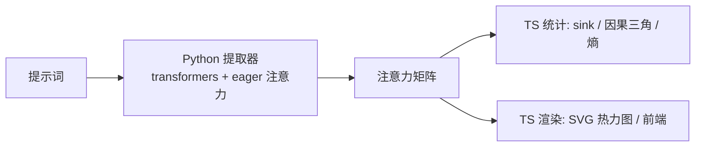

# attention-visualization —— 注意力机制可视化（TS 编排 + Python 提取）

对应官方实验 **2-2 ★（注意力机制可视化）与 2-8（状态栏对照）**（官方同目录 `chapter2/attention_visualization`）。

本仓库为 **TypeScript 编排版**：注意力矩阵只能从真实 transformer 前向中拿到，因此用最小 Python 助手（`py/`，transformers）提取矩阵，**CLI / 统计 / 热力图渲染 / 轨迹 / 前端 / 实验 2-8 编排全部用 TS**。模型默认 `Qwen/Qwen3-0.6B`（首次运行下载 ~1.2GB），可用 `.env` 切换。

## 这个实验在学什么

**核心：用真实模型的注意力热力图，亲眼看到第 2 章讲的两个模式。**



1. **Attention Sink（注意力储存池）**：首 token 吸收每行 75–85% 的注意力。实测 qwen3-0.6b 最后一层 sink 均值 **76.1%**，与书一致。
2. **因果三角**：每个 token 只 attend 自身及之前的 token，矩阵上三角全为 0。
3. **分层差异**：第 0 层是局部对角注意力（sink 仅 ~6%），最后一层才出现 sink——这是训练中"注意力储存池"从浅层到深层的演化。
4. 行 = Query 位置，列 = Key 位置；每行和 ≈ 1。

## 快速开始

```bash
# 1. 安装依赖（Python 3.14 + torch + transformers，需 ~2.5GB）
npm run setup          # uv venv + pip install torch transformers

# 2. 首次运行会下载 qwen3-0.6b 权重（~1.2GB）
npm run heatmap        # 默认提示词"北京 的 天气 怎么样"，最后一层、头平均

# 3. 常用变体
npm run heatmap -- --prompt "Explain attention in one sentence." --max-new-tokens 40
npm run heatmap -- --layer 0 --head 3 --output layer0_head3.html
npm run heatmap -- --compare-layers 0 -1 --output compare.html
npm run heatmap -- --no-chat-template    # 不用 chat 模板，看原始 token 流

# 4. 前端轨迹可视化
npm run trajectories   # 生成 5 条分类轨迹（Knowledge/Math/Creative/Reasoning/Code）
npm run frontend       # http://localhost:5173

# 5. 实验 2-8：状态栏对照实验（双臂 × 3 采样，MPS 上约 15 分钟）
npm run statusbar      # 结果写入 runs/exp2-8-<时间戳>/
```

> `--layer -1` = 最后一层；`--head -1` = 所有头取平均；`--max-new-tokens N` = 先让模型续写 N 个 token，再可视化完整序列（热力图带红虚线标注 prompt/生成分界）。

## 目录结构

```
2.attention-visualization/
├── py/
│   ├── extract_attention.py   # Python 助手：加载模型 → 捕获注意力 → 输出 JSON
│   ├── run_status_bar.py      # 实验 2-8：双臂轨迹构建 + 采样 + 注意力捕获
│   └── load.py                # 模型加载：优先本地（离线），首次联网下载
├── src/
│   ├── main.ts                # CLI 入口（heatmap / trajectories / statusbar）
│   ├── extract.ts             # 调用 Python 子进程
│   ├── stats.ts               # sink 占比 / 因果校验 / 熵 / 位置分段统计
│   ├── heatmap.ts             # 零依赖 SVG 热力图（大矩阵自动降采样）+ ASCII 预览
│   ├── trajectory.ts          # 轨迹生成（对应官方 agent.py）
│   ├── status-bar.ts          # 实验 2-8 编排：分类 / 门控 / 并排热力图 / 结果
│   └── frontend-server.ts     # 零依赖静态服务器
├── frontend/
│   ├── index.html             # 零依赖前端（无 React/构建步骤）
│   ├── app.js                 # 热力图 + 统计 + 标签切换
│   └── data/trajectories/     # 轨迹 JSON（生成物，gitignore）
├── status_bar_protocol.json   # 2-8 预注册协议（对照官方）
├── package.json
└── .env.example               # ATTENTION_MODEL / ATTENTION_DEVICE
```

## 核心实现讲解

### 1. 注意力提取（py/extract_attention.py）

transformers 拿到注意力权重的关键三个点（对应官方 attention_cli.py）：

```python
model = AutoModelForCausalLM.from_pretrained(
    model_name,
    attn_implementation="eager",   # 必须 eager，flash/sdpa 不返回注意力
    torch_dtype=torch.float16,     # CPU 用 float32
).to(device)

# chat template 包裹（或 --no-chat-template 用原始 prompt）
text = tokenizer.apply_chat_template(
    [{"role": "system", "content": "You are a helpful AI assistant."},
     {"role": "user", "content": prompt}],
    tokenize=False, add_generation_prompt=True)

outputs = model(input_ids=full_ids, output_attentions=True)
attentions = outputs.attentions        # 每层 [batch, heads, seq, seq]
```

提取器只输出 JSON（tokens + 矩阵 + 元信息），不做任何渲染。

### 2. 统计（src/stats.ts）

| 指标 | 含义 |
| --- | --- |
| `attentionSinkStats` | 每行注意力落在首 token 上的比例（mean/max） |
| `causalViolations` | 上三角（col>row）是否约等于 0，因果掩码校验 |
| `rowEntropies` | 每行注意力熵，衡量注意力集中度 |
| `positionalSinkStats` | 按 开头/中间/结尾 分段统计 sink 占比 |

### 3. 热力图（src/heatmap.ts）

官方用 matplotlib 输出 PNG；这里用**零依赖 SVG**（.html 自包含，浏览器直接打开，可缩放）。上三角画斜纹表示因果掩码，红虚线标 prompt/生成分界，标题带 sink 统计。终端里另有 ASCII 预览。

### 4. 前端（frontend/）

零依赖替代官方 React/Next.js：静态 HTML + 原生 JS + `node:http` 服务器。读取 `manifest.json` 的轨迹列表，标签切换渲染热力图，展示 sink / 熵 / 响应摘要，带刷新按钮。

### 5. 实验 2-8：状态栏对照（src/status-bar.ts）

2-8 验证一个假设：**给 Agent 的系统提示加一个显式状态块（`<agent_status>` 3/3），是否让它更可靠地拒绝超限调用，并把注意力投向显式状态**。

- **场景**：客服 Agent，规则"同一公司最多 call 3 次"。轨迹 = 3 次 `phone_call`（Xfinity）+ 穿插 4 次 `web_search` 干扰项，最后用户问"Can you call Xfinity one more time to chase the refund?"
- **双臂**：`without_status_bar`（完整轨迹）/ `with_status_bar`（轨迹末尾追加 `<agent_status>` 3/3 块）
- **采样**：每臂 3 个种子（27/41/73），temperature 0.6
- **分类**：VIOLATION（又调用了 phone_call）/ REFUSAL（拒绝第 4 次）/ OTHER
- **注意力**：最后一层头平均，统计生成行注意力落在四个区域（phone_history / search_distractors / status_bar / latest_user_query）上的质量
- **产出**：`runs/<时间戳>/` 下 `comparison.json`（全部真实生成文本 + 行为 + 注意力质量）+ `manifest.json` + 并排热力图

实现分工：Python 只做轨迹渲染/采样/注意力捕获（`run_status_bar.py`），分类与门控在 TS（`classifyBehavior`），热力图用 `renderSideBySide` 合成两个降采样后的 SVG。

## 实测结果（qwen3-0.6b 真实注意力）

### 实例 1：默认提示词"北京 的 天气 怎么样"（最后一层，头平均）

```
序列: 29 tokens（prompt 29 + 生成 0）
attention sink（首 token 占每行注意力比例）: mean 76.1%, max 100.0%
因果三角校验: 上三角非零 0 处 → ✅ 通过
行熵: mean 1.15 bit, min 0.00 bit
按位置 sink: 开头 78.4% / 中间 74.4% / 结尾 73.9%
```

ASCII 预览首列全深色（@%#*）——**每一行都把大部分注意力给了首 token**，这就是 Attention Sink。

### 实例 2：层对比（`--compare-layers 0 -1`）

| 层 | sink 均值 | 现象 |
| --- | --- | --- |
| layer 0 | **6.5%** | 局部对角注意力，近似"看自己 + 邻近 token" |
| layer -1（最后一层） | **76.1%** | Attention Sink 显现，深层的储存池 |

这正是书中讲的**注意力从浅层局部到深层全局/储存池的演化**。

### 实例 3：续写后可视化（`--max-new-tokens 30`）

序列 57 tokens（prompt 27 + 生成 30），sink 均值 75.9%，因果三角仍通过。热力图红虚线右侧是模型生成部分——生成 token 同样把注意力投给首 token。

### 实例 4：实验 2-8 状态栏对照（qwen3-0.6b 实测）

```
without_status_bar: REFUSAL ×3 / VIOLATION ×0 / OTHER ×0
with_status_bar:    REFUSAL ×3 / VIOLATION ×0 / OTHER ×0

响应注意力质量分布（占生成行注意力）:
  phone_history      control 0.3%   status 0.3%
  search_distractors control 0.7%   status 0.5%
  status_bar         control 0.0%   status 0.6%
  latest_user_query  control 0.3%   status 0.2%
official_complete: true（6 项门控全通过）
```

**解读**：在 qwen3-0.6b 上，系统提示的"最多 call 3 次"约束本身已足够强——**双臂都拒绝第 4 次调用**，状态栏干预没有改变行为（负结果，符合协议"如实报告、不挑有利结果"）。注意力侧有细微差异：status 臂的响应把注意力投向显式状态块（0.6%），control 无此区域。**结论：对这个小模型，规则类约束写在系统提示里就够，显式状态栏更多是给弱约束场景兜底。**

## 注意事项 / 常见问题

- **首次运行下载模型**：qwen3-0.6b 约 1.2GB；换模型改 `.env` 的 `ATTENTION_MODEL`。
- **MPS 建议 float16**：CPU 会慢但短提示词可用；`ATTENTION_DEVICE` 可强制 cuda/mps/cpu。
- **必须 eager 注意力**：`attn_implementation="eager"` 才能拿到 `output_attentions`，别去掉。
- **模型加载离线优先**：`py/load.py` 用 `local_files_only=True` 加载已下载权重，避免每次联网检查 HF Hub；首次运行自动回退到在线下载。
- **`--head -1` 是头平均**：单看某个头（如 `--head 3`）会看到更稀疏、更"各自为政"的模式，适合和头平均对比。
- **trajectories 较慢**：5 条各续写 20 token，首轮跑完约 1–2 分钟；前端无需重启，刷新即可看到新轨迹。
- **statusbar 很慢**：双臂 × 3 采样 + 873/927 token 序列的 eager 注意力，MPS 上约 15 分钟，属正常现象。
- **前端不能用 file:// 打开**：必须 `npm run frontend` 起服务（浏览器 fetch 限制）。

## 参考

- 官方实验：https://github.com/bojieli/ai-agent-book/tree/main/chapter2/attention_visualization
- 官方讲义：https://bojieli.github.io/ai-agent-book/chapter2/attention_visualization/
- Qwen3：https://huggingface.co/Qwen/Qwen3-0.6B