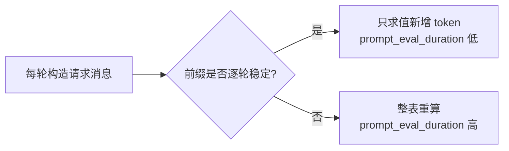

# kv-cache —— KV Cache 与错误上下文管理模式（TypeScript + Ollama）

对应官方实验 2-3 ★★：**常见的错误上下文管理模式**（`chapter2/kv-cache`）。

本仓库为 **TypeScript 移植版**：用 Ollama 本地模型演示 **KV Cache 在六种上下文实现模式下的利用率差异**——一种正确、五种反模式，看似无害的小改动如何让前缀缓存失效、拖慢延迟并推高成本。

## 这个实验在学什么

**核心：KV Cache 前缀命中取决于"上下文内容是否逐轮稳定"。**

KV Cache 缓存注意力键值对；当对话前缀保持不变时可直接复用，显著减少 prompt 求值计算、改善首 token 延迟（TTFT）。官方用 Moonshot Kimi 上报的 `cached_tokens` 做信号；**Ollama 不上报该字段**，但 `prompt_eval_duration`（prompt 求值时长）在命中前缀缓存时大幅下降（实测 358ms → 71ms）——本移植用它作缓存信号。



6 种模式（1 正确 + 5 反模式）：

| 模式 | 实现 | 对前缀的影响 |
| --- | --- | --- |
| `correct` | 固定 system，消息逐轮追加 | 稳定 → **命中** |
| `dynamic_system` | system 每轮带时间戳 | 整表重建 → 失效 |
| `shuffled_tools` | 工具顺序每轮轮转（工具被模板化进 prompt） | 前缀变化 → 失效 |
| `dynamic_profile` | 前缀插入每轮变化的"用户额度" | 前缀变化 → 失效 |
| `sliding_window` | 只保留最近 5 条 | 前缀被截断 → 失效 |
| `text_format` | 历史写成纯文本单条消息 | 序列化格式全变 → 失效 |

## 快速开始

```bash
# 前提：Ollama 运行 + gemma4:latest（或任意支持工具调用的模型）

npm install
npm run run -- --mode correct          # 单模式
npm run run -- --mode text_format
npm run compare                        # 依次跑全部 6 种模式 + 对比表 + 图表（约 2-3 分钟）
npm run report                         # 离线对比（读 runs/ 下 result_*.json，无需模型）
```

常用参数：

```bash
npm run run -- --mode correct --task "..." --root-dir ../..
npm run run -- --mode sliding_window --output my_run.json
npm run report -- --cache-price-ratio 0.5        # 改成本示意计价比例
```

**结果与可视化**：所有结果 JSON 统一存到 `runs/` 目录；`npm run compare` / `npm run report` 会自动生成 **`runs/report.html`**——一个自包含的零依赖可视化页面（SVG 条形图对比 Cache% / 总时长 / TTFT），浏览器直接打开即可。

## 教学笔记

更详细的白话版讲解（KV Cache 是什么、为什么小改动破坏力大、每种反模式的本质）见 [`KV_CACHE_LEARNING_NOTE.md`](KV_CACHE_LEARNING_NOTE.md)。建议先看这份再看代码。

## 目录结构

```
3.kv-cache/
├── src/
│   ├── main.ts       # CLI（--mode / --compare / --report / --task / --root-dir）
│   ├── agent.ts      # KVCacheAgent：6 种模式 + ReAct 循环 + 指标
│   ├── tools.ts      # LocalFileTools：read_file / find / grep（限定 root 内）
│   └── report.ts     # 对比表 + 成本示意 + 零依赖 HTML 图表
├── runs/             # 结果 JSON + report.html（gitignore，不提交）
├── package.json
└── .env.example      # OLLAMA_BASE_URL / MODEL_NAME
```

## 核心实现讲解

### 1. 6 种模式的本质差异（agent.ts `buildMessages`）

模式差异只在"每轮请求消息的内容是否稳定"：

```ts
switch (this.mode) {
  case 'correct':
    return [sys, { role: 'user', content: task }, ...this.turns];   // 固定前缀 + 追加
  case 'dynamic_system':
    return [sys(带时间戳), task, ...this.turns];                     // system 每轮变
  case 'dynamic_profile':
    return [sys, profile(额度每轮变), task, ...this.turns];
  case 'sliding_window':
    return [sys, ...this.turns.slice(-5)];                           // 截断
  case 'text_format':
    return [{ role: 'user', content: 纯文本拼接全部历史 }];            // 格式全变
}
```

正确模式与前缀稳定的反模式（`shuffled_tools` 消息部分）内容一致——但 `shuffled_tools` 通过轮转**工具顺序**破坏缓存：Ollama 会把 tools 模板化进 prompt，顺序一变前缀就变（实测：同序 71ms / 乱序 293ms）。

### 2. 缓存信号（Ollama 的 `prompt_eval_duration`）

Ollama 不返回 `cached_tokens`，但命中前缀缓存时只求值新增 token，`prompt_eval_duration` 大幅下降。为了跨模式/跨长度可比，用聚合式指标：

```
no_cache_eval_ms = Σ(prompt_tokens_i / 冷启动求值速度)   # 每轮全量重算的理论值
cache_ratio      = 1 - 实际总求值时 / no_cache_eval_ms
```

`correct` 每轮只求值新增 token → 实际总求值时远小于全量重算 → cache_ratio 高；反模式每轮全量重算 → 接近 0。

### 3. ReAct 循环 + 安全文件工具

- 工具失败以结果回传并继续（不中断 Agent）
- 路径解析后校验必须在 root 内（`tools.ts resolve`）
- 无工具调用 → 视为最终答案，结束

## 实测结果（gemma4:latest，任务：查找 .ts 文件并读 agent.ts/tools.ts 总结）

```
Mode             Iters  1st TTFT   Avg TTFT   Total(s)   Prompt    Cache%    Bill.Tok   Save%
---------------------------------------------------------------------------------------------
correct              4     0.36s     1.51s    16.57      6183    22.3%       5599   18.2%
dynamic_profile      4     0.57s     2.75s    23.31      6380    12.4%       6474    9.9%
dynamic_system       4     0.57s     2.76s    20.64      6293     7.8%       6520    6.4%
shuffled_tools       4     0.53s     2.64s    20.51      6189    11.7%       6206    9.5%
sliding_window       6     0.51s     2.38s    42.46      8952    16.7%       9298   12.7%
text_format          8     0.07s     0.15s    35.21      3344     0.0%       5291    0.0%
```

同样数据，条形图视角（README 内直接可读）：

```
Cache% (越高越好)        Total(s) (越低越好)
──────────────────────────────────────────────────────────────────
correct          22.3% ############################   16.57s #################
dynamic_profile  12.4% ################               23.31s #############
dynamic_system    7.8% ##########                     20.64s ##############
shuffled_tools   11.7% ###############                20.51s ##############
sliding_window   16.7% #####################          42.46s
text_format         0%                                35.21s #####
```

**解读（与官方结论一致）：**

- **correct** 总时间最短（16.6s）、Cache% 最高（22.3%）——前缀稳定，每轮只求值新增 token。
- **dynamic_system / dynamic_profile / shuffled_tools** 都在 20-23s，Cache% 掉到 8-12%——看似无害的"加个时间戳 / 插条动态数据 / 换个顺序"就打断缓存。
- **sliding_window** 的 Cache% 有 16.7% 但**总时间最长（42.5s）**——截断后 Agent 上下文丢失、多跑了几轮（6 轮 vs 4 轮）。高缓存比例出现在小/截断提示词上 ≠ 高效运行。
- **text_format** 0% 缓存，Agent 卡在工具循环直到 8 轮上限（35.2s）——纯文本格式既破坏了缓存也破坏了结构化上下文。

> 与官方 Kimi 数值不可直接比（指标口径不同：官方 `cached_tokens` vs 我们 `prompt_eval_duration` 估算），但**相对趋势完全一致**。

## 关键洞察（就是这本书的结论）

1. **稳定上下文至关重要** —— 前缀不变，缓存才生效。
2. **顺序也重要** —— 相同内容重排（工具顺序）也会破缓存。
3. **前缀中避免动态元数据** —— 时间戳 / 额度 / 计数器别塞进前缀。
4. **使用结构化消息格式** —— 纯文本拼接破坏 API 期望的格式与缓存。
5. **完整历史往往优于激进截断** —— sliding_window 又慢又丢上下文。

## 注意事项 / 常见问题

- **缓存依赖模型常驻内存**：Ollama 默认 `keep_alive=5m`，短时间连续请求才能命中前缀缓存；别在两次运行间隔太久。
- **`prompt_eval_duration` 有噪声**：每 token 求值速度随序列长度变化，所以用聚合式（整段运行）而非单轮对比。
- **反模式可能"卡住"**：`text_format` / `sliding_window` 会明显劣化 Agent 能力（重复调工具、丢上下文），这是模式本身的预期效果，不是 bug。
- **`--report` 离线可用**：读 `runs/` 下 `result_*.json` 生成对比表与 `runs/report.html`，无需模型运行；同一模式多次运行只保留最新一份。
- **可视化**：`runs/report.html` 是自包含页面，用浏览器打开即可看三条 SVG 条形图（Cache% / 总时长 / 平均 TTFT），无需任何依赖或网络。
- **不同模型结果略有差异**：换模型改 `.env` 的 `MODEL_NAME`；工具调用弱的模型（如 `llama3.2:1b`）可能导致反模式更容易卡住。

## 参考

- 官方实验：https://github.com/bojieli/ai-agent-book/tree/main/chapter2/kv-cache
- 官方讲义：https://bojieli.github.io/ai-agent-book/chapter2/kv-cache/
- ReAct：https://arxiv.org/abs/2210.03629
- KV Cache 原理：https://huggingface.co/docs/transformers/kv_cache