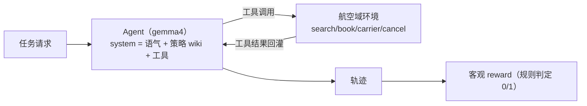

# prompt-engineering —— 提示工程消融实验（τ-bench-like，TypeScript + Ollama）

对应官方实验 2-4 ★★：**提示工程的消融实验**（`chapter2/prompt-engineering`）。

本仓库为 **TypeScript 移植版**：基于 τ-bench（tool-agent-user 交互基准）的航空域环境，用 Ollama gemma4 真实跑 Agent，量化**语气、指令组织、工具描述**三个消融维度对任务成功率的影响。

## 这个实验在学什么

**核心：把 Agent 看成"聪明的新员工"——清晰指令、结构化组织、工具文档决定了它能不能干成事。**

消融框架：6 个臂 × 5 个航空任务，每个臂只改动提示的某一个维度，其余不变，对比客观 reward（0/1）。

| 消融轴 | 做法 | 预期影响 |
| --- | --- | --- |
| **语气**（default/trump/casual） | 改系统提示的语气风格 | 成功率影响小 |
| **Wiki 规则随机化** | 把策略手册打乱成混沌平面列表（去结构、模糊规则、混干扰句） | 指令遵循受损 |
| **移除工具描述** | 工具与参数描述置空 | 误用工具、完成率下降 |
| **组合** | 三轴叠加 | 最差 |



## 快速开始

```bash
# 前提：Ollama 运行 + gemma4:latest

npm install
npm run all                       # 6 臂 × 5 任务 + 成功率对比表 + HTML 报告（约 2-3 分钟）
npm run run -- --arm baseline     # 只跑一个臂
npm run report                    # 离线汇总 runs/ 下轨迹
```

输出：
- `runs/ablation_<时间戳>.json` — 全部轨迹（工具调用序列 + reward）
- `runs/report.html` — 零依赖可视化页面（成功率条形图 + 每任务轨迹明细）

## 目录结构

```
4.prompt-engineering/
├── src/
│   ├── main.ts        # CLI（--all / --arm / --report）+ 对比表 + HTML 报告
│   ├── agent.ts       # ReAct 工具调用 Agent（Ollama 原生工具调用）
│   ├── env.ts         # 航空域环境：工具 schema、策略 wiki、5 任务、reward 判定
│   └── ablations.ts   # 6 个臂的消融配置
├── runs/              # 轨迹 + report.html（gitignore）
├── package.json
└── .env.example       # OLLAMA_BASE_URL / MODEL_NAME
```

## 核心实现讲解

### 1. 消融轴（ablations.ts + env.ts）

三个轴独立组合成 6 个臂：

```ts
export const ARMS = [
  { name: 'baseline',       tone: 'default', randomizeWiki: false, removeToolDescriptions: false },
  { name: 'tone_trump',     tone: 'trump',   ... },
  { name: 'tone_casual',    tone: 'casual',  ... },
  { name: 'wiki_random',    tone: 'default', randomizeWiki: true,  ... },
  { name: 'no_tool_desc',   tone: 'default', removeToolDescriptions: true },
  { name: 'all_ablations',  tone: 'casual',  randomizeWiki: true,  removeToolDescriptions: true },
];
```

- **语气**：同一套指令配三种 persona——专业 / 夸张自信（trump）/ emoji 俚语（casual）
- **wiki_random**：正常的策略 wiki 是有编号、分条的结构化手册；随机化版去编号、改写模糊化、混入 5 条干扰句、打乱顺序——模型难以分辨哪些才是真规则
- **no_tool_desc**：所有工具与参数 `description` 置空

### 2. 航空域环境（env.ts）

- **工具**：`search_flights` / `book_flight` / `search_hotels` / `book_hotel` / `get_carrier_info` / `cancel_booking`
- **策略 wiki**（5 条规则，含 trap）：UA 7 月航班必须 refundable、直达不许经停、带小孩订 4 星+、查行李先调 get_carrier_info、最便宜优先
- **5 个任务**：每条都埋了"正确选项"——如 t1 直达航班只有两个 UA 选项，便宜的 UA1234 非 refundable（违反 7 月规则），正确应订更贵的 UA5678

### 3. 客观 reward（env.ts）

reward 不看模型自吹，只看**工具调用序列**：

```ts
// t1 示例：订了正确的 UA5678（直接 + 7月 UA refundable），且没订违规的 UA1234
const reward = okBook && !badBook ? 1 : 0;
```

- 用户是**脚本化的**（任务请求即完整需求，Agent 无需追问），保证确定性
- Agent 每轮工具调用都会被记录，最后按任务 rubric 判定 0/1

## 实测结果（gemma4:latest，一次完整运行，6 臂 × 5 任务）

```
Experiment                        Success Rate      Tasks        Relative
----------------------------------------------------------------------
baseline          100.0%   5/ 5       100%  ⭐
tone_trump        100.0%   5/ 5       100%
no_tool_desc      100.0%   5/ 5       100%
tone_casual        80.0%   4/ 5        80%
wiki_random        60.0%   3/ 5        60%
all_ablations      60.0%   3/ 5        60%
```

**解读（与官方实验 2-4 的方向一致）：**

- **baseline 最佳（100%）**——清晰专业指令 + 结构化策略 + 完整工具文档。
- **语气影响小**（trump 100%、casual 80%）——和官方结论"语气对成功率影响不大"一致。模型能读懂专业/夸张/随意的措辞，决策基本不变。
- **wiki_random 明显受损（60%）**——策略手册失去结构后，t1（UA 7 月 refundable）和 t2（先查行李再订）这类依赖规则的陷阱最容易踩。**结构 > 语气**。
- **all_ablations 最差（60%）**——组合消融没有恢复任何能力。
- **no_tool_desc 未见退化（100%）**——本移植的局限：工具名自解释 + 搜索结果字段丰富，gemma4 靠名字和结果就能正确使用工具；τ-bench 原版里工具更复杂、参数更多，去掉描述才明显掉分。

> ⚠️ n=5 每臂噪声较大（如 casual 偶发 80%），属单次代表运行，方向性信号才是结论。官方也提示"以你自己的完整运行为准，别拿冒烟数字当结论"。

## 关键洞察（就是这本书的结论）

1. **清晰指令至关重要** —— 结构化信息、任务描述、工具用法
2. **上下文组织影响理解** —— 逻辑排序、相关规则归并、优先级明确（wiki 随机化掉 40%）
3. **工具文档不可或缺** —— 在复杂工具场景下，用途 / 参数 / 示例决定能否正确使用
4. **专业性与一致性支撑有效 Agent** —— 语气只是锦上添花，不是决定性因素
5. 好提示工程 = 好员工培训

## 注意事项 / 常见问题

- **模型要支持工具调用**：默认 gemma4:latest；换成弱模型（如 `llama3.2:1b`）可能基线就大量失败，消融信号被淹没。
- **gemma4 需要"完成任务"指令**：多步任务（查完信息再落单）不显式要求"必须调用 book_* 才算完成"，模型会查完就答、不订票。
- **wiki_random 要真"混沌"**：只重排规则顺序不构成消融——需要去结构 + 模糊化 + 干扰句，否则 gemma4 照读不误。
- **n=5 噪声大**：想看更稳的排序，把任务加到 10+ 或多跑几个 seed 平均；单次 3/5 vs 4/5 的差异不算结论。
- **离线可复现**：`npm run report` 从 `runs/ablation_*.json` 重建对比表与 HTML，无需重跑模型。

## 参考

- 官方实验：https://github.com/bojieli/ai-agent-book/tree/main/chapter2/prompt-engineering
- 官方讲义：https://bojieli.github.io/ai-agent-book/chapter2/prompt-engineering/
- τ-bench 论文：https://arxiv.org/abs/2406.12045
- τ²-Bench：https://arxiv.org/abs/2506.07982