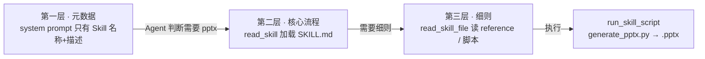

# agent-skills-ppt —— 渐进式披露式 Agent Skills（TypeScript + Ollama）

对应官方实验 2-6 ★★：**使用 Agent Skills 从论文生成演示文稿**（`chapter2/agent-skills-ppt`）。

本仓库为 **TypeScript 移植版**：实现三层**渐进式披露（Progressive Disclosure）** 的 Skills 机制——Agent 启动时只看到薄 Skill 目录（元数据），判断任务需要 `pptx` Skill 后才逐层加载完整流程、子文档与捆绑脚本，最终用 python-pptx 生成真实的 `.pptx`。模型用 Ollama gemma4 驱动。

## 这个实验在学什么

**核心：Agent 通过"渐进式披露"按需加载专业领域 Skill 即可完成复杂任务，无需把所有知识一次性塞进系统提示词。**



| 层 | 内容 | 对应工具 | 上下文占用 |
| --- | --- | --- | --- |
| 第一层 | Skill 的 name + description（frontmatter） | 启动时注入 system prompt | ~数百 token |
| 第二层 | 完整 `SKILL.md`（流程 + 脚本约定） | `read_skill(name)` | 命中才加载 |
| 第三层 | `reference.md` / 脚本源码 | `read_skill_file(name, path)` | 按需加载 |
| 执行 | 捆绑脚本生成文件 | `run_skill_script(...)` | 落盘 |

## 快速开始

```bash
# 1. 装依赖（Python 3.14 + python-pptx）
npm run setup

# 2. 在线模式：Ollama gemma4 驱动渐进式披露（真实实验）
npm run run                       # 读 papers/sample_paper.md → 生成 output/presentation.pptx
npm run run -- --paper papers/sample_paper.md -o output/deck.pptx

# 3. 离线模式：确定性演示同一套工具通道（无需模型）
npm run offline
```

生成的 `output/presentation.pptx` 会被 python-pptx 重新打开校验（页数 + 每页标题），保证 PowerPoint / Keynote 可打开。

## 目录结构

```
6.agent-skills-ppt/
├── src/
│   ├── main.ts      # CLI（在线 / 离线 / 校验）
│   ├── agent.ts     # SkillsAgent：read_skill / read_skill_file / run_skill_script + ReAct
│   └── catalog.ts   # 扫描 SKILL.md frontmatter → 薄目录（第一层）
├── skills/pptx/
│   ├── SKILL.md     # L1 frontmatter + L2 核心流程
│   ├── reference.md # L3 细则（大纲 schema / 设计要点）
│   └── scripts/
│       ├── generate_pptx.py  # python-pptx 生成器（捆绑脚本）
│       └── verify_pptx.py    # 校验脚本（重新打开读页数/标题）
├── papers/
│   ├── sample_paper.md       # 自带精简论文（在线输入）
│   └── sample_outline.json   # 离线大纲（确定性演示）
├── output/            # 生成的 pptx（gitignore）
├── package.json
└── .env.example       # OLLAMA_BASE_URL / MODEL_NAME
```

## 核心实现讲解

### 1. 薄目录扫描（catalog.ts）—— 第一层

只解析每个 SKILL.md 顶部 YAML frontmatter 的 `name` + `description`，拼进 system prompt：

```ts
// skills/pptx/SKILL.md 开头
---
name: pptx
description: 从论文或大纲生成 PowerPoint（.pptx）演示文稿。Use when ...
---
```

### 2. 三个加载工具（agent.ts）—— 第二、三层 + 执行

```ts
read_skill(name)                    // 加载 skills/<name>/SKILL.md 全文
read_skill_file(name, path)         // 加载 reference.md / 脚本源码
run_skill_script(name, script, outline, output)  // 写 outline 到临时文件 → python 执行
```

`run_skill_script` 会校验：脚本路径必须在 `skills/<name>/scripts/` 内（越界拒绝）、outline 是合法 JSON、并检查 python 退出码。

### 3. 模型驱动的真实实验（agent.ts runAgentic）

Agent 在 ReAct 循环里自主决策：先 `read_skill("pptx")` 了解流程 → 规划大纲 → `run_skill_script` 生成 → 结束。**系统提示词从头到尾只有薄目录，模型不预先知道怎么做 PPT**。

## 实测记录（gemma4:latest 在线模式）

```
模型开始渐进式披露...
  → read_skill({"name":"pptx"})
  → run_skill_script({"name":"pptx","outline":"{\"title\": \"渐进式披露式 Agent Skills：上下文效率提升研究\", ...})

【校验】用 python-pptx 重新打开生成的文件：
总页数: 7
  第 1 页标题: 渐进式披露式 Agent Skills：上下文效率提升研究
  第 2 页标题: 引言：Agent 能力扩展的挑战
  第 3 页标题: 核心方法：渐进式披露 (Progressive Disclosure)
  第 4 页标题: 三层披露机制详解
  第 5 页标题: 实验验证：PPT 生成任务
  第 6 页标题: 实验结果与讨论
  第 7 页标题: 结论与意义
校验通过：output/presentation.pptx
```

**观察**：gemma4 启动时只知道 `pptx` 技能的存在与用途，调用 `read_skill` 后才拿到完整流程（SKILL.md），随后自己规划大纲并生成真实 pptx——**渐进式披露成功**。离线模式用预置大纲走同一工具通道，确定性复现。

## 调优记录（踩过的坑）

- **工具参数被截断**：gemma4 单次 tool_call 的参数有长度上限，长 outline（>1500 字符）会被截断导致 JSON 解析失败。对策：SKILL.md 明确要求"outline ≤1000 字符、bullet 用短短语、6-8 页"，并在截断错误时把原因回传给模型让它压缩重试。
- **中文直引号破坏 JSON**：论文正文的 `"..."` 会被模型原样抄进 JSON 字符串。对策：`repairJson` 逐字符扫描，把字符串内部裸 `"` 转义。
- **顶层结构**：模型偶尔把 outline 生成数组而非对象，生成器做了兼容（`list` 也接受）。

## 注意事项 / 常见问题

- **需要 python-pptx**：`npm run setup` 创建 `.venv` 并安装；脚本执行走 `.venv/bin/python`（python-pptx 保证文件被 PowerPoint 认可）。
- **大纲要短**：在线模式让模型生成大纲时，超长会被截断。已写进 SKILL.md 约束。
- **模型随机性**：页数与标题由模型即时规划，每次略有差异；离线模式完全确定。
- **换论文**：`npm run run -- --paper 你的论文.md`。

## 参考

- 官方实验：https://github.com/bojieli/ai-agent-book/tree/main/chapter2/agent-skills-ppt
- 官方讲义：https://bojieli.github.io/ai-agent-book/chapter2/agent-skills-ppt/
- Anthropic Agent Skills：https://www.anthropic.com/news/skills