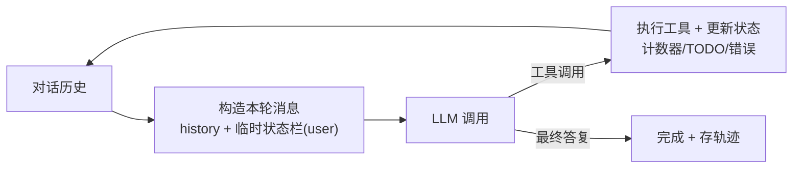

# system-hint —— Agent 状态栏（System Hint）技术（TypeScript + Ollama）

对应官方实验 2-9 ★★：**几种好用的 Agent 状态栏技术**（`chapter2/system-hint`）。

本仓库为 **TypeScript 移植版**：实现 **Agent 状态栏（Status Bar）** 机制——每次调用 LLM 前，把动态状态摘要作为一条**临时 `role=user` 消息**注入上下文末尾，**不写入对话历史**（避免永久污染上下文）。五种技术：时间戳、工具调用计数器、TODO 列表、详细错误、系统状态感知，外加轨迹自动保存。

## 这个实验在学什么

**核心：Agent 状态栏 = 把"当前状态"临时喂给模型，让它每轮都看得见最新进展，又不用背在历史里。**



| 技术 | 作用 | 开关 |
| --- | --- | --- |
| **时间戳** | 消息/状态带当前时间，多日场景不丢时间感 | `--no-timestamps` |
| **工具计数器** | 每个工具调用次数 + 次数过高提醒，抑制死循环 | `--no-counter` |
| **TODO 列表** | 四态管理（pending/in_progress/completed/cancelled），多步任务不迷路 | `--no-todo` |
| **详细错误** | 上次错误类型 + 参数 + 修复建议 | `--no-errors` |
| **系统状态** | 当前目录 / 平台，命令执行有上下文 | `--no-state` |

## 快速开始

```bash
# 前提：Ollama 运行 + gemma4:latest

npm install
npm run preview                    # 离线预览状态栏长什么样（不发 LLM）
npm run single -- --task "..."     # 单任务（默认全开）
npm run demo -- basic              # 一个任务，逐轮展示注入的状态栏
npm run demo -- comparison         # 同一任务：无状态栏 vs 有状态栏
npm run demo -- loop               # 防死循环演示（run-tests 反复失败场景）
```

轨迹自动保存到 `runs/trajectory_*.json`（历史 + 工具调用 + TODO + 配置）。

## 目录结构

```
9.system-hint/
├── src/
│   ├── main.ts      # CLI（preview / single / demo）
│   ├── agent.ts     # SystemHintAgent：状态栏注入循环 + 工具 + 轨迹
│   └── status.ts    # 状态栏构建器（5 种技术）+ 错误建议映射
├── runs/            # 轨迹 JSON（gitignore）
├── package.json
└── .env.example     # OLLAMA_BASE_URL / MODEL_NAME
```

## 核心实现讲解

### 1. 状态栏注入（agent.ts run）

**关键机制**：状态栏是临时消息，构造本轮 `messages` 时加在末尾，用完即弃，绝不写进 `history`：

```ts
// 每轮：状态栏作为临时 user 消息注入，history 不包含它
const statusHint = { role: 'user', content: buildStatusBar(config, state) };
const messages = [history[0], { role: 'system', ... }, ...history.slice(1), statusHint];
const response = await chatOnce(messages);   // 下一轮重新构造，状态栏总是最新的
```

状态在 `state` 中维护：`toolCalls` 计数、`todos`、`lastError`，每轮执行工具后更新。

### 2. 五种技术（status.ts）

```ts
buildStatusBar(cfg, state) → "=== SYSTEM STATUS ===\nTime: ...\nCWD: ...\n
  === TOOL CALLS ===\nrun_command: 5 次\n注意: ... 请停止重试...\n
  === TODO LIST ===\n[1] ✅ ... [2] 🔄 ...\n
  === LAST ERROR ===\ntool=... suggestion=..."
```

- **计数器防死循环**：同一工具调用 ≥5 次时，状态栏显式提示"停止重试、换方法"。
- **TODO 管理**：Agent 通过 `update_todo` 工具维护列表；系统提示规定"3 步以上先建 TODO、同时只一个 in_progress"。
- **详细错误**：`errorSuggestion` 把常见错误映射成修复建议（ENOENT→先 find、命令不存在→查拼写）。

## 实测记录（gemma4:latest）

### 演示 1：basic —— 逐轮注入的状态栏动态演化

```
── 第 1 轮注入的状态栏 ──
=== SYSTEM STATUS ===  Time: 2026-09-11 14:50:52  CWD: .../9.system-hint  Platform: darwin arm64
=== TOOL CALLS ===（尚无工具调用）
=== TODO LIST ===（暂无 TODO。若任务需要 3 步以上，先用 update_todo 建立计划）

── 第 2 轮注入的状态栏 ──
=== TOOL CALLS ===  update_todo: 1 次
=== TODO LIST ===  [1] ⏳ Write the Python code to print numbers 1 to 10. (pending)

[basic] 迭代 4 次完成 · 工具调用: update_todo, write_file, run_command
共注入了 4 次状态栏——每次调用前模型都看到最新状态，但历史里并不包含这些临时消息。
```

**观察**：第 1 轮模型只看到空状态；它按系统提示**自动建了 TODO**（`update_todo`），第 2 轮状态栏就反映出来——计数器与 TODO 随执行实时更新，但都只在注入时出现，不污染历史。

### 演示 2：loop —— 防死循环（run-tests 反复失败）

```
无状态栏: 迭代 2 · run_command✗ ×1   → gemma4 试一次发现"命令不存在"直接停下
有状态栏: 迭代 4 · update_todo, run_command✗, update_todo
```

> ⚠️ **gemma4 太"聪明"**：即便没有计数器，它也一眼看出 `run-tests` 不存在而不再重试（2 轮即停）。状态栏的防死循环价值在**更弱的模型 / 更模糊的任务**上才明显（官方基于 kimi-k3 的完整对照实验能展示 15 vs 21、60% vs 95% 的差异）。我们的演示证明了**机制本身工作正常**（注入、计数、TODO、错误建议都对模型可见），但行为差异被强模型拉平——这是和实验 2-5 一样的"强模型现象"。

## 关键洞察（就是这本书的结论）

1. **状态栏要"临时注入、用完即弃"** —— 提供状态但避免永久上下文污染。
2. **计数器抑制死循环** —— 显式告诉模型"你已经重试 N 次了"。
3. **TODO 保持多步聚焦** —— 复杂任务先建计划，同时只有一个 in_progress。
4. **详细错误帮助自我纠正** —— 失败后给建议，而不是让模型盲猜。
5. **强模型天然更稳** —— 防死循环等收益在弱模型/复杂任务上才显著。

## 注意事项 / 常见问题

- **状态栏不进历史**：每次调用重新构造，这是本机制与"直接把状态写进对话"的本质区别。
- **TODO 由 Agent 驱动**：通过 `update_todo` 工具维护；系统提示引导复杂任务自动建 TODO。
- **强模型拉平差异**：gemma4 对简单任务/失败命令天然稳健，loop/comparison 对比不明显属预期。
- **`--no-*` 开关**可关掉任意技术看它对状态栏的贡献（preview 里也有说明）。
- **⚠️ run_command 会真实执行模型生成的 Shell 命令**：`sh -c <command>`，10 秒超时、工作目录限定在项目内。模型是本地 gemma4、任务为教学性质，但这是真实命令执行——不要暴露给不可信输入，也不要放宽 cwd/超时限制。
- **轨迹离线可看**：`runs/trajectory_*.json` 记录完整执行（历史/工具/TODO/配置）。

## 参考

- 官方实验：https://github.com/bojieli/ai-agent-book/tree/main/chapter2/system-hint
- 官方讲义：https://bojieli.github.io/ai-agent-book/chapter2/system-hint/
- ReAct：https://arxiv.org/abs/2210.03629