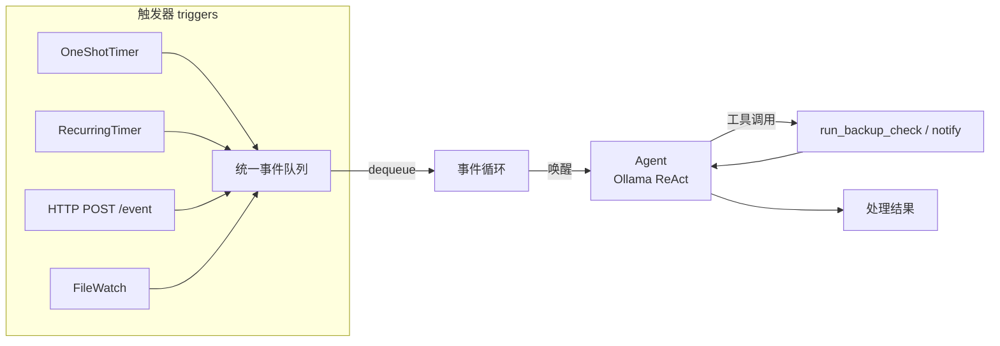

# event-trigger-agent / 事件驱动 Agent

> Chapter 6-1: 外部事件（定时器 / HTTP / 文件变更）通过统一事件队列唤醒 Agent
> 对应《AI Agent 开发实战》第 6 章实验 6-1

← [返回第 6 章目录](../README.md)

## 这个实验在学什么

**核心：Agent 不一定每次都由用户发一句话启动。定时任务、文件变化和外部消息也可以触发工作。**

官方 6-1 用 FastAPI + 42 个 MCP 工具演示"原生异步 + 事件驱动"；本仓库为 **TypeScript 简化版**，保留官方核心机制：

1. **事件类型与事件格式分离**：`EventType`（web_message / im_message / github_pr_update / timer_trigger / file_change / system_alert …）+ 统一事件结构 `{ event_type, content, metadata }`
2. **触发发生 ≠ 任务完成**：触发器（一次性/循环定时器、HTTP、文件监听）只在事件发生时把结构化事件**推入统一事件队列**，事件循环逐个取出再唤醒 Agent——触发与处理解耦
3. **周期事件重入**：循环定时器可能在上一次处理结束前再次到达，队列自然累积（演示中 Ollama 处理 11s，期间 health_check 已入队 2 条）
4. **mock 离线模式**：无需模型即可演示完整闭环（注册 → 触发 → 唤醒 → 处理）



## 快速开始

```bash
# 前提：Ollama 运行（在线模式）

npm install

# 离线模式（无需模型，机制演示）
npm run demo -- --mock --trigger timer --delay 1500 --interval 3000 --duration 9000
npm run demo -- --mock --trigger http --http-port 8787
npm run demo -- --mock --trigger file

# 在线模式（Ollama 真实处理事件）
npm run demo                          # timer 触发器（一次性备份检查 + 循环健康检查）
npm run demo -- --trigger http        # 起 HTTP 端点接收外部事件
#   curl -X POST http://localhost:8787/event -H 'content-type: application/json' \
#     -d '{"event_type":"web_message","content":"帮我把今天的工作日志整理成三条要点"}'
```

## 目录结构

```
1.event-trigger-agent/
├── src/
│   ├── events.ts     # EventType 枚举 + 统一事件格式
│   ├── queue.ts      # 事件队列（FIFO + 窗口去重 + 上限丢弃）
│   ├── triggers.ts   # 一次性/循环定时器 + HTTP 入口 + 文件监听
│   ├── tools.ts      # run_backup_check / notify 两个事件场景工具
│   ├── agent.ts      # 事件 Agent（mock 模拟动作 / Ollama ReAct）
│   └── main.ts       # 事件循环入口：注册 → 触发 → 唤醒 → 处理
├── notifications.log # notify 工具写入的动作日志
└── watched_dir/      # 文件监听演示目录
```

## 核心实现讲解

### 1. 统一事件队列（queue.ts）

所有来源的事件进同一条队列，事件循环逐个取出：

```ts
enqueue(e): { status: 'accepted' | 'merged' | 'dropped' }
  - dedupeWindowMs: 同 (type, trigger) 在窗口内合并，记录 occurrences
  - maxSize: 超限丢弃最旧，防积压撑爆内存
dequeue(): 取出下一条（FIFO）
```

### 2. 触发器只管"事件发生"（triggers.ts）

```ts
// 一次性定时器：delayMs 后触发一次 → 入队
oneShotTimer(queue, 'daily_backup_check', 2000, '请检查每日备份是否已经完成。')
// 循环定时器：每 intervalMs 触发（可能重入）
recurringTimer(queue, 'health_check', 3000, '请检查服务器是否正常运行。')
// HTTP 入口：POST /event 注入任意外部事件
httpTrigger(queue, 8787)
```

### 3. Agent 被唤醒后处理（agent.ts）

- **mock**：按事件类型打印模拟动作序列，机制演示无需模型
- **在线**：事件（来源 + 类型 + 内容）作为 user 消息 → Ollama ReAct → 必要时调工具（`run_backup_check` 拿真实备份状态）→ 回灌 → 最终回复

### 4. 事件循环（main.ts）

```
注册触发器 → 启动循环（durationMs 内）→
  队列空？等 100ms → 有事件？dequeue → 唤醒 Agent 处理
→ 结束打印统计（processed / dropped）
```

## 实测结果（gemma4，Ollama 本地）

```
离线 mock（timer）：3 个事件全部按序处理，闭环正常，0 dropped
在线（timer，delay 1500ms / interval 5000ms / duration 12000ms）：
  一次性备份检查 → Agent 调用 run_backup_check → 基于真实结果回复（处理耗时 11168ms）
  期间 health_check 触发 2 次 → 因处理慢于触发频率，事件在队列中积压
```

**积压正是教学点**：Ollama 处理一个事件要 ~11s，而循环定时器每 5s 触发一次——「周期事件在上一次处理结束前再次到达」被真实复现，处理与触发解耦的价值可见。

## 关键洞察

- **事件驱动 vs 请求/响应**：请求/响应是"用户问一句、Agent 答一句"；事件驱动是"外部世界随时唤醒 Agent"，Agent 是被动响应者
- **触发与处理解耦**：触发器只负责入队，不负责完成任务——慢处理不会阻塞事件发生，快事件不会丢失（有上限）
- **mock 先行**：机制（事件队列/触发/唤醒）与模型无关，先用 mock 验证机制，再接 Ollama
- **事件格式统一**：不管来源是定时器还是 HTTP，都收敛成 `{ event_type, content, metadata }`，Agent 只需学会处理一种结构

## 注意事项

- 在线模式需要 Ollama 运行（默认 gemma4:latest，可用 `.env` 的 `OLLAMA_MODEL` 更换）
- HTTP 入口未做认证/限流，仅教学演示；生产需 HTTPS + API Key + 输入校验（官方安全清单）
- `notifications.log` 由 notify 工具写入项目根目录
