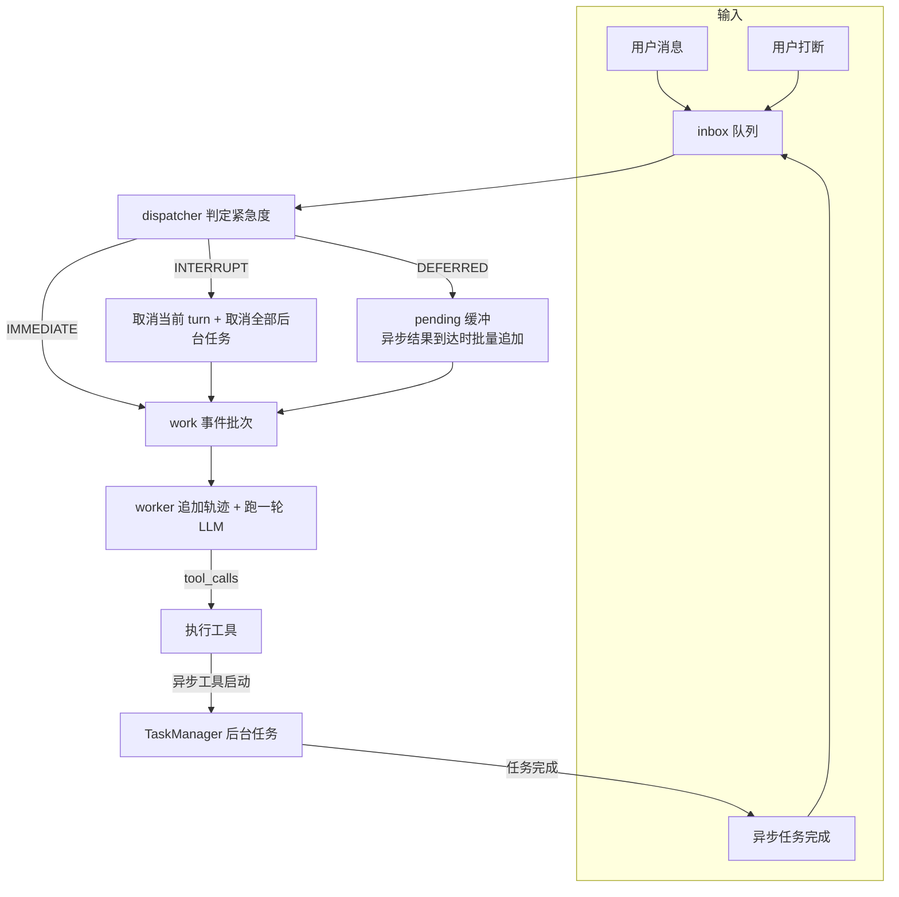

# async-agent / 异步 Agent（Flux 风格）

> Chapter 6-2: 异步工具执行 + 事件批量处理 + 打断机制 + 并行任务取消/状态查询
> 对应《AI Agent 开发实战》第 6 章实验 6-2

← [返回第 6 章目录](../README.md)

## 这个实验在学什么

**核心：一个工具调用需要很久时，Agent 不必完全停住——异步执行让系统同时管理多个未完成动作，还要应对中途取消和恢复。**

官方 6-2（async-agent / Flux）基于 asyncio 实现了事件驱动异步 Agent 框架；本仓库为 **TypeScript 简化版**，把四件事分开演示：

1. **异步工具执行**：`run_terminal_command` 调用后**立即返回 task_id 占位符**，任务在后台跑，不阻塞 Agent
2. **事件队列与批量处理**：非紧急事件先进 `pending` 缓冲；异步结果到达时**一次性批量追加**再触发 LLM
3. **打断机制**：用户"取消/停止"（INTERRUPT）立即取消当前 turn + 所有后台异步工具，并留痕
4. **并行任务的取消与状态查询**：`query_task` / `cancel_task` 按 ID 操作；任务完成以"新事件"注入对话



## 快速开始

```bash
npm install

# 三个离线演示（无需 LLM / API key，可复现、可测量）
npm run demo            # 并行 vs 串行 + 打断与恢复 + 检查点持久化
npm run parallel        # 只跑：并行工具调用的墙钟对比（加速比）
npm run interrupt       # 只跑：长任务中断 → 恢复
npm run state           # 只跑：检查点持久化 → 跨会话恢复

# 在线场景（需要 Ollama 运行，默认 gemma4:latest）
npm run llm             # 依次跑三个场景
npm run llm -- 1        # 异步工具调用：启动后台任务，不阻塞等待
npm run llm -- 2        # 打断：取消正在运行的 turn 与后台任务
npm run llm -- 3        # 排队批量处理：补充指令与异步结果批量追加
```

## 目录结构

```
2.async-agent/
├── src/
│   ├── events.ts    # 事件模型（含轨迹回放用 message）+ 紧急度判定 classify_urgency
│   ├── tasks.ts     # TaskManager：模拟异步"终端命令"，进度/取消/快照/恢复
│   ├── tools.ts     # 4 个工具：run_terminal_command / get_current_time / query_task / cancel_task
│   ├── runtime.ts   # AgentRuntime：inbox → dispatcher → worker 事件循环 + LLM turn + 检查点
│   ├── demos.ts     # 三个离线演示（并行 / 打断 / 检查点）
│   └── main.ts      # 统一命令行入口
├── src/checkpoints/ # 检查点落盘目录（gitignore，运行时自动生成）
└── .env.example     # OLLAMA_BASE_URL / OLLAMA_MODEL
```

## 核心实现讲解

### 1. 紧急度判定（events.ts）

```ts
classifyUrgency(text): 'INTERRUPT' | 'IMMEDIATE' | 'DEFERRED'
  - 含打断关键词（取消/停止/stop…）→ INTERRUPT：取消式处理
  - 提问（带问号或疑问词）→ IMMEDIATE：立即回应，不打断后台
  - 其它补充指令 → DEFERRED：进 pending 缓冲，批量处理
```

### 2. 异步任务管理（tasks.ts）

```ts
TaskManager.start(command)  → 立即返回 TaskState{ taskId, status: 'running', progress }
TaskManager.query(taskId)   → 查询进度（0-100%）
TaskManager.cancel(taskId)  → 按 ID 取消；cancelAll() 取消全部
TaskManager.snapshot()      → 检查点快照；restore() → 还原为 suspended（保留最后进度）
```

用 `setInterval` 模拟"异步终端命令"（每 tick 推进进度），**绝不真跑危险命令**，保证可复现。

### 3. 事件循环（runtime.ts）

```
inbox（所有原始事件）
  → dispatcher：取事件 → 判定紧急度 → 分流
      INTERRUPT → 取消当前 turn（turnAborted 标志）+ cancelAll + 组装打断批次留痕
      async.result → 批量 [该结果 + pending 积压] 入 work
      IMMEDIATE / 空闲时的普通指令 → 直接入 work
      其它 → pending 缓冲
  → worker：取批次 → 追加到轨迹 → 跑一轮可取消的 LLM（MAX_STEPS 上限）
```

### 4. LLM turn（runtime.ts）

```
run_llm_turn() 循环：
  build_messages() ← 轨迹回放（system + 各事件 message）
  → ollama.chat(tools: TOOL_SCHEMAS)
  → 有 tool_calls？执行（同步工具就地回填；异步工具返回 task_id 占位符）
  → 无 tool_calls？给出最终回复，结束本轮
```

### 5. 检查点（runtime.ts）

```ts
saveCheckpoint(path) → JSON：{ trajectory: [...], tasks: [...], savedAt }
loadCheckpoint(path) → 重建轨迹 + 任务 restore 为 suspended
```

## 实测结果（gemma4，Ollama 本地）

```
离线 parallel：串行 4.51s vs 并行 1.50s → 加速比 3.00x（墙钟从「求和」降到「取最大」）
离线 interrupt：fast 已完成 / mid、slow 冻结在中途 → 新任务正常跑完
离线 state：轨迹 3 → 恢复 3 一致；任务 35%/18% → suspended 保留原进度

在线 1（异步工具）：LLM 并行调用 run_terminal_command ×2 → 立即返回 task_id，不阻塞
在线 2（打断）：轮询检测到后台任务启动 → 提交"取消" → 打断回执「取消任务 T1, T2」
在线 3（批量）：补充指令进 pending（积压 1 条）→ 异步结果到达 → 「批量处理 1 条积压」
```

## 关键洞察

- **异步 ≠ 不做事**：异步工具是"立即返回占位符 + 后台推进 + 完成时以新事件回灌"，把等待时间还给 Agent 去做别的事
- **打断的粒度取决于运行时能否抢占**：asyncio 用 `CancelledError` 硬取消一个任务；TS 单线程只能用"标志位 + 边界检查"（在 LLM/工具调用之间中止）——取消语义要按运行时能力设计
- **排队缓冲让"慢后台"不阻塞"快指令"**：DEFERRED 事件先进 pending，等下一次异步结果时批量追加，一次 LLM 调用消化多条
- **状态可持久化才有"恢复"**：轨迹 + 任务进度落盘 → 跨会话重建 LLM 上下文；运行中任务标记 `suspended`，让上层决定续跑还是重跑

## 注意事项

- 离线演示（demo / parallel / interrupt / state）**不需要 Ollama 也不需要 API key**
- 在线场景需要 Ollama 运行（默认 gemma4:latest，可用 `.env` 的 `OLLAMA_MODEL` 更换）
- LLM 决策耗时不定：打断场景用"轮询 `tasks.anyRunning()`"对齐时序，而非固定 sleep
- 检查点文件写入 `src/checkpoints/`（已 gitignore）
