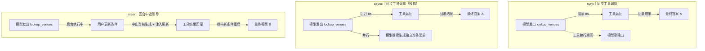

# async-steering / 同步 vs 异步 vs 中途引导

> Chapter 6-3: 模型原生异步工具调用 与 回合中途引导（steering）的三组对照
> 对应《AI Agent 开发实战》第 6 章实验 6-3

← [返回第 6 章目录](../README.md)

## 这个实验在学什么

**核心：同样一个"查询场地"任务，同步调用、原生异步、中途引导三种语义下，工具执行期间模型的行为完全不同——这决定了对"用户中途修改条件"的响应能力。**

官方 6-3 用 OpenAI Responses API 的 `async tool calling` 与 `response.steer` 验证了五个组别；本仓库为 **TypeScript + Ollama 简化版**，实现其中三个核心语义（三连对照）：

1. **sync（同步工具调用）**：工具执行 8 秒期间模型**零输出**，结果回灌后才继续 → 初始条件选 A
2. **async（原生异步工具调用，框架级模拟）**：工具后台执行，模型**并行继续输出**独立准备清单 → 初始条件选 A
3. **steer（回合中途引导）**：工具执行期间用户更新条件，框架**中止当前生成并以新条件重启** → 两条更新都生效时选 B



## 受控场地任务

为一次模拟会议选择**满足人数与预算的最便宜场地**；`lookup_venues` 等待 8 秒后返回场地表 + 随机回执 `receipt`。场地表**不在提示词内**，模型必须调用工具才能看到；最终答案必须引用 `receipt` 并标注 `source: demo`。

| 场地 | 价格 | 容量 | 初始要求（预算 2000 / 人数 20） | 更新后（预算 1000 / 人数 10） |
| -- | ---- | -- | ---- | ---- |
| A | 1800 | 30 | ✅ 选择 A | ❌ 超预算 |
| B | 900 | 12 | ❌ 容量不足 | ✅ 选择 B |
| C | 600 | 8 | ❌ 容量不足 | ❌ 容量不足 |

## 快速开始

```bash
npm install
cp .env.example .env   # 可选：换模型 / 服务地址

# 前提：Ollama 运行（默认 gemma4:latest）
npm run sync    # 对照一：同步工具调用（工具执行期间零输出 → 选 A）
npm run async   # 对照二：异步工具调用模拟（并行输出准备清单 → 选 A）
npm run steer   # 对照三：中途引导（更新条件后重启 → 选 B）
npm run eval    # 三组全跑
```

## 目录结构

```
3.async-steering/
├── src/
│   ├── tools.ts   # lookup_venues：受控工具（8s 延迟返回场地表 + 随机 receipt）
│   ├── llm.ts     # Ollama 聊天封装：非流式 / 流式（含 abort 中止生成）
│   ├── shared.ts  # 场地表 / 初始与更新条件 / SYSTEM_PROMPT / 验收 verify
│   ├── sync.ts    # 对照一：同步工具调用
│   ├── async.ts   # 对照二：异步工具调用（框架级模拟）
│   ├── steer.ts   # 对照三：回合中途引导（替换式 steering）
│   └── main.ts    # 统一命令行入口
└── .env.example   # OLLAMA_BASE_URL / OLLAMA_MODEL
```

## 核心实现讲解

### 1. 受控工具（tools.ts）

```ts
lookupVenues(): Promise<{ venues, receipt }>
  - await sleep(8000) 模拟网络/数据库延迟
  - 返回固定场地表 + 每次调用随机生成的 receipt
```

### 2. LLM 封装（llm.ts）

```ts
chat({ model, client, messages, tools, stream, onToken, signal })
  → { message, stream? }   // message 含 content 与 tool_calls；stream 可 abort()

- stream: false → 一次拿到完整回复（同步语义）
- stream: true  → 逐步回调 onToken；返回 AbortableAsyncIterator（abort() 中止生成）
```

### 3. 三种语义的差别（对照核心）

```
sync：
  模型发出 tool_call → await 工具 8s（期间零输出）→ 结果回灌 → 最终答案
async（模拟）：
  模型发出 tool_call → 工具后台执行 → 同时并行流式生成"独立准备清单" → 结果回灌 → 最终答案
steer：
  模型发出 tool_call → 工具后台执行 → 中途收到用户更新
    → stream.abort() 中止当前回合生成 → 注入更新条件（新 user 消息）
    → 等真实工具结果回灌 → 携带新条件重启生成 → 最终答案
```

### 4. 为什么"中途引导 ≠ 追加一条消息"（steer.ts 教学点）

官方实验中 steering 依赖服务端原生能力（同连接 `response.steer`）。Ollama 没有此能力，本仓库实现**框架级替换式 steering**：

1. 工具执行期间收到更新，立即 `AbortController` 中止正在进行的 LLM 生成
2. 把更新作为**新的用户消息**注入对话（放在工具结果之后、重启之前）
3. 工具结果（原始 call_id）到达后，携带新条件重启生成

教学点：**条件变更必须"打断正在执行的回合"才能影响后续决策**——如果是 sync 语义，模型在工具结果返回前不会收到更新，最终答案会停留在旧条件。

## 实测结果（gemma4，Ollama 本地）

```
sync  ：模型发出 lookup_venues → 阻塞 8.0s 无输出 → 结果回灌 → 最终选 A，引用 receipt，source: demo
async ：工具后台执行，期间模型并行生成 5 条独立准备清单 → 工具返回 → 最终选 A
steer ：工具执行 2s 时收到更新（预算 1000/人数 10）→ 中止生成 → 工具结果回灌
        → 重启后最终选 B（A 超预算、C 容量不足），引用 receipt，source: demo
```

三组验收全部通过（引用 receipt / 正确选择 / source: demo）。

## 关键洞察

- **同步 vs 异步：等待被隐藏 vs 等待被利用**——sync 让工具延迟完全暴露为"静默等待"；async 把这段时间还给模型继续产出
- **async 是模型/接口的原生能力**：Ollama 的 chat 接口发完 tool_call 就结束回合，本仓库用"后台 Promise + 并行流式生成"模拟观察到的 async 行为
- **steering 需要"可中断"的接口**：普通同步调用无法自动获得中途引导；必须在生成层面支持中止 + 重启
- **替换式 steering 的教学价值**：条件在工具执行中变化时，谁先到达谁生效——重启生成的时机决定最终答案采用哪一版条件

## 注意事项

- 需要 Ollama 运行（默认 gemma4:latest，可用 `.env` 更换模型）
- 每轮耗时受本地模型推理速度影响，`npm run eval` 三组全跑约需 2-3 分钟
- 模型若未调用工具会打印 `✘` 并提前结束该组，重跑即可
- `stream.abort()` 依赖 ollama JS 客户端的 `AbortableAsyncIterator`
